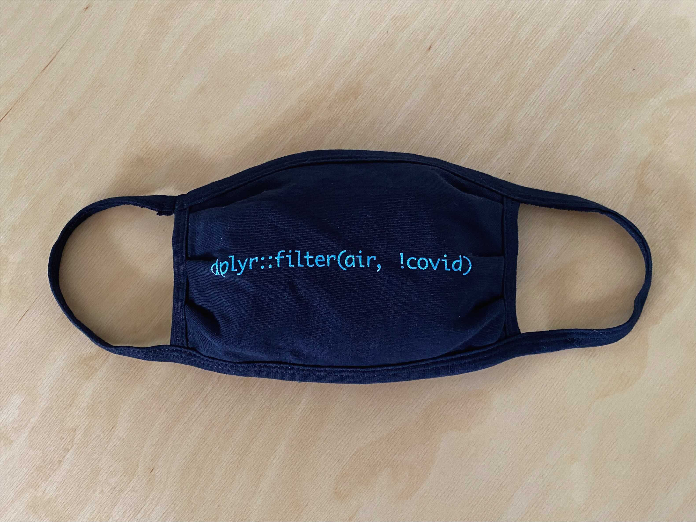

# SOC4001 Procesamiento avanzado de bases de datos en `R`
Este repositorio contiene el material del curso SOC4001 Procesamiento Avanzado de Bases de Datos en R, dictado el segundo semestre 2024 por el Departamento de Sociología de la Universidad Católica de Chile a estudiantes de educación continua como parte del [`[Diplomado en Procesamiento y Análisis de Datos Sociales]`](https://educacioncontinua.uc.cl/41343-ficha-diplomado-en-procesamiento-y-analisis-de-datos-sociales) y del nuevo [`[Diplomado en WebScraping y visualización de datos sociales en R]`](https://educacioncontinua.uc.cl/programas/diplomado-en-webscraping-y-visualizacion-de-datos-sociales-en-r/). Para mayores detalles ver el [`[programa]`](files/syllabus_soc4001.pdf) del curso.

Encuentra también aquí una presentación sobre el rol de `R` como *lingua franca* de la ciencia de datos: [`[Slides]`](https://mebucca.github.io/dar_soc4001/slides/presentation/presentation#1) [`[.Rmd]`](slides/presentation/presentation.Rmd). 

---
## Equipo Docente

- Mauricio Bucca, Profesor Asistente Sociología UC, [`[sitio personal]`](https://mebucca.github.io)

- Roberto Cantillán, Estudiante Doctoral Sociología UC, [`[sitio personal]`](https://rcantillan.rbind.io/)

---
## Calendario

Nota: Todas las clases serán grabadas y estarán disponibles por 7 días. El link de Zoom es el siguiente: [`[Link]`](https://puc.zoom.us/j/89233554492?pwd=LnXajNRNLCbKDhEr4jAE7WYtNoCqIb.1)

| Día    | Fecha          | Contenido                                                     | Profesor   | Material                                                                                                  |
|--------|----------------|---------------------------------------------------------------|------------|-----------------------------------------------------------------------------------------------------------|
| Martes | agosto 20       | Introducción a R base y Rstudio                               | Mauricio B.| [`[Pres]`](https://mebucca.github.io/dar_soc4001/slides/class_1/class_1#1) [`[.Rmd]`](slides/class_1/class_1.Rmd) |
| Jueves | agosto 22       | Bases de datos en R (CASEN 2020)                              | Mauricio B.| [`[Pres]`](https://mebucca.github.io/dar_soc4001/slides/class_2/class_2#1) [`[.Rmd]`](slides/class_2/class_2.Rmd)  |
| Martes | agosto 27       | R base y bases de datos en R (CASEN 2020)                     | Roberto C. |                                                                                                           |
| Jueves | agosto 29       | Workflow                                                      | Mauricio B.|  [`[workflow.zip]`](slides/class_4/workflow.zip) |                                                                                                         |
| Martes | septiembre 3    | Workflow                                                      | Roberto C. |                                                                                                           |
| Jueves | septiembre 5    | tidyverse, pipes y funciones básicas con dplyr                | Mauricio B.|                                                                    [`[Pres]`](https://mebucca.github.io/dar_soc4001/slides/class_5/class_5#1) [`[.Rmd]`](slides/class_5/class_5.Rmd) |
| Martes | septiembre 10   | tidyverse, pipes y funciones básicas con dplyr                | Roberto C. |                                                                    [`[.R]`](slides/class_5/class_5.R) |
| Jueves | septiembre 12   | Creación y transformación de variables con dplyr              | Mauricio B.|   [`[Pres]`](https://mebucca.github.io/dar_soc4001/slides/class_6/class_6#1) [`[.Rmd]`](slides/class_6/class_6.Rmd)                                                                                                       |
| Martes | septiembre 24   | Creación y transformación de variables con dplyr              | Roberto C. |  [`[.R]`](slides/class_6/class_6.R)                                                                                                          |
| Jueves | septiembre 26   | Resumen de datos agrupados y combinación de bases de datos con dplyr | Mauricio B.| [`[Pres]`](https://mebucca.github.io/dar_soc4001/slides/class_7/class_7#1) [`[.Rmd]`](slides/class_7/class_7.Rmd)                                                                                                          |
| Martes | octubre 1       | Resumen de datos agrupados y combinación de bases de datos con dplyr | Roberto C. | [`[.R]`](slides/class_7/class_7.R)                                                                                                       |
| Jueves | octubre 3       | Transformación de datos anchos y largos con tidyr            | Mauricio B.|                                                                                                           |
| Martes | octubre 8       | Transformación de datos anchos y largos con tidyr            | Roberto C. |                                                                                                           |
| Jueves | octubre 10      | Datos faltantes con tidyr                                    | Mauricio B.|                                                                                                           |
| Martes | octubre 15      | Datos faltantes con tidyr                                    | Roberto C. |                                                                                                           |
| Jueves | octubre 17      | Iteración y automatización con purrr                         | Mauricio B.|                                                                                                           |
| Martes | octubre 22      | Iteración y automatización con purrr                         | Roberto C. |                                                                                                           |
| Jueves | octubre 24      | Visualización de datos con ggplot                            | Mauricio B.|                                                                                                           |
| Martes | octubre 29      | Visualización de datos con ggplot                            | Mauricio B.|                                                                                                           |
| Martes | noviembre 5     | Visualización de datos con ggplot                            | Roberto C. |                                                                                                           |
| Jueves | noviembre 7     | Reportes automatizados con rmarkdown y knitr                 | Mauricio B.|                                                                                                           |
| Martes | noviembre 12    | Reportes automatizados con rmarkdown y knitr                 | Roberto C. |                                                                                                           |
| Jueves | noviembre 14    | Workflow avanzado                                            | Mauricio B.|                                                                                                           |

---
## Cápsulas

- Descargar e instalar `R`: [`[Cápsula]`](https://www.youtube.com/watch?v=805yKZSQaj8)
- For loops: [`[Cápsula]`](https://www.youtube.com/watch?v=Jg473dyiahY)

---
## Evaluaciones 

| Evaluación    | Asignación     | Entrega        | Material                             |
|---------------|----------------|----------------|--------------------------------------|
| Tarea 1       | agosto 22       | agosto 29       | [`[T1 sols]`](https://mebucca.github.io/dar_soc4001/homework/t_1_answers#1) [`[T1.qmd] sols`](homework/t_1_answers.qmd)          |
| Tarea 2       | septiembre 3    | septiembre 12   | [`[T2.zip sols]`](homework/t2_answers.zip)                                     |
| Tarea 3       | septiembre 12   | septiembre 26   | [`[T3]`](https://mebucca.github.io/dar_soc4001/homework/t_3#1) [`[T3.qmd]`](homework/t_3.qmd)                                      |
| Tarea 4       | octubre 3       | octubre 17      |                                      |
| Tarea 5       | octubre 24      | noviembre 7     |                                      |
| Trabajo final | noviembre 7     | diciembre 8     |                                      |

#### Lectura recomendada

- **R for Data Science** (Hadley Wickham & Garrett Grolemund) [`[e-Book]`](https://r4ds.had.co.nz/)

