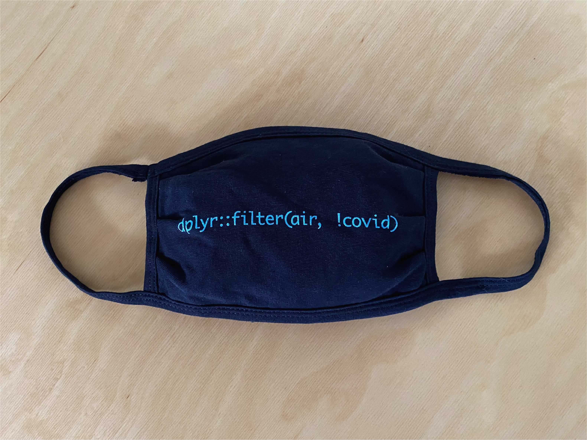

# SOC4001 Procesamiento avanzado de bases de datos en `R`
Este repositorio contiene el material del curso SOC4001 Procesamiento Avanzado de Bases de Datos en R, dictado el segundo semestre 2022 por el Departamento de Sociología de la Universidad Católica de Chile a estudiantes de educación continua como parte del [`[Diplomado en Procesamiento y Análisis de Datos Sociales]`](https://educacioncontinua.uc.cl/41343-ficha-diplomado-en-procesamiento-y-analisis-de-datos-sociales) y del nuevo [`[Diplomado en WebScraping y visualización de datos sociales en R]`](https://educacioncontinua.uc.cl/programas/diplomado-en-webscraping-y-visualizacion-de-datos-sociales-en-r/). Para mayores detalles ver el [`[programa]`](files/syllabus_soc4001.pdf) del curso.

Encuentra también aquí una presentación sobre el rol de `R` como *lingua franca* de la ciencia de datos: [`[Slides]`](https://mebucca.github.io/dar_soc4001/slides/presentation/presentation#1) [`[.Rmd]`](slides/presentation/presentation.Rmd). 

---
## Calendario

Nota: Todas las clases serán grabadas y estarán disponibles por 7 días. El link de Zoom es el siguiente: [`[Link]`](https://puc.zoom.us/j/88146189946)

| Fecha             | Contenido                                                      | Material                                                                                                                                                  |
|-------------------|---------------------------------------------------------------|----------------------------------------------------------------------------------------------------------------------------------------------------------|
| mar ago 29        | Introducción a R base y Rstudio                               | [`[Slides]`](https://mebucca.github.io/dar_soc4001/slides/class_1/class_1#1) [`[.Rmd]`](slides/class_1/class_1.Rmd)                                        |
| jue ago 31        | Introducción a R base y Rstudio                               |  [`[.R]`](slides/class_1/class_1.R)                                            |
| mar sep 5         | R base y bases de datos en R                                  | [`[Slides]`](https://mebucca.github.io/dar_soc4001/slides/class_2/class_2#1) [`[.Rmd]`](slides/class_2/class_2.Rmd)                                                                                                                                                         |
| jue sep 7         | R base y bases de datos en R                                  |  [`[.R]`](slides/class_2/class_2.R)                                                                                                                                                         |
| mar sep 12        | Workflow                                                      | [`[workflow.zip]`](slides/class_4/workflow.zip)                                                                                                                                                       |
| jue sep 21        | Workflow                                                      |  [`[workflow_ta.zip]`](slides/class_4/workflow_ta.zip)                                                                                                                                                              |
| mar sep 26        | `tidyverse`, pipes y funciones básicas con `dplyr`            |  [`[Slides]`](https://mebucca.github.io/dar_soc4001/slides/class_5/class_5#1) [`[.Rmd]`](slides/class_5/class_5.Rmd)                                                                                                                                                        |
| jue sep 28        | `tidyverse`, pipes y funciones básicas con `dplyr`            |  [`[.R]`](slides/class_5/class_5.R)                                                                                                                                                              |
| mar oct 3         | Creación y transformación de variables con `dplyr`            |     [`[Slides]`](https://mebucca.github.io/dar_soc4001/slides/class_6/class_6#1) [`[.Rmd]`](slides/class_6/class_6.Rmd)                                                                                                                                                                                                        |
| jue oct 5         | Creación y transformación de variables con `dplyr`            |   [`[.R]`](slides/class_6/class_6.R)                                                                                                                                                          |
| mar oct 10        | Resumen de datos agrupados y combinación de bases de datos con `dyplr` |          [`[Slides]`](https://mebucca.github.io/dar_soc4001/slides/class_7/class_7#1) [`[.Rmd]`](slides/class_7/class_7.Rmd)                                                                                                                                                 |
| jue oct 12        | Resumen de datos agrupados y combinación de bases de datos con `dyplr` |            [`[.R]`](slides/class_7/class_7.R)                                                                                                                                                  |
| mar oct 17        | Transformación de datos anchos y largos con `tidyr`           |          [`[Slides]`](https://mebucca.github.io/dar_soc4001/slides/class_9/class_9#1) [`[.Rmd]`](slides/class_9/class_9.Rmd)                                                                                                                                                |
| jue oct 19        | Transformación de datos anchos y largos con `tidyr`           |   [`[.R]`](slides/class_9/class_9.R)                                                                                                                                                        |
| mar oct 24        | Datos faltantes con `tidyr`                                   | [`[Slides]`](https://mebucca.github.io/dar_soc4001/slides/class_10/class_10#1) [`[.Rmd]`](slides/class_10/class_10.Rmd)                                                                                                                                                         |
| jue oct 26        | Datos faltantes con `tidyr`                                   |  [`[.R]`](https://mebucca.github.io/dar_soc4001/slides/class_10/ejercicio_practico#1)                                                                                                                                                          |
| jue nov 2         | Visualización de datos con `ggplot`                          |    [`[Slides]`](https://mebucca.github.io/dar_soc4001/slides/class_11/class_11#1)  [`[.Rmd]`](slides/class_11/class_11.Rmd)   [`[Ejemplo]`](slides/class_11/Ejemplo.R)                                                                                                                                                         |
| mar nov 7         | Visualización de datos con `ggplot`                        |   [`[.R]`](https://mebucca.github.io/dar_soc4001/slides/class_11/ejercicio_practico#1)                                                                                                                                                              |
| jue nov 9         | Visualización de datos con `ggplot`                           | [`[Slides]`](https://mebucca.github.io/dar_soc4001/slides/class_12/class_12#1)  [`[.Rmd]`](slides/class_12/class_12.Rmd)                                                                                                                                                            |
| mar nov 14        | Visualización de datos con `ggplot`                            |    [`[.R]`](slides/class_12/ejercicio_practico.R)   [`[PDF]`](slides/class_12/miprimerggplot.pdf)                                                                                                                                                                 |
| jue nov 16        | Iteración y automatización con `purrr`                          |    [`[Slides]`](https://mebucca.github.io/dar_soc4001/slides/class_13/class_13#1)  [`[.Rmd]`](slides/class_13/class_13.Rmd)                                                                                                                                                       |
| mar nov 21        | Reportes automatizados con `rmarkdown` y `knitr`              |                                                                                                                                                          |
| jue nov 23        | Reportes automatizados con `rmarkdown` y `knitr`              |                                                                                                                                                          |
| mar nov 28        | Workflow avanzado                                             |                                                                                                                                                          |

---
## Cápsulas

- Descargar e instalar `R`: [`[Cápsula]`](https://posit.co/download/rstudio-desktop/): 

---
## Evaluaciones 

|                | Asignación   | Entrega       | Material |
|----------------|--------------|---------------|----------|
| Tarea 1        | septiembre 12 | septiembre 21 |  [`[T1 Respuestas]`](homework/t_1_answers.pdf)        |
| Tarea 2        | octubre 03    | octubre 17    |  [`[T2 Respuestas]`](https://mebucca.github.io/dar_soc4001/homework/t_2#1)            |
| Tarea 3        | octubre 17    | octubre 24    |  [`[T3 Respuestas]`](https://mebucca.github.io/dar_soc4001/homework/t_3#1)         | 
| Tarea 4        | noviembre 2   | noviembre 12  |  [`[T4 Respuestas]`](https://mebucca.github.io/dar_soc4001/homework/t_4_answer#1)       |
| Tarea 5        |   | noviembre 21  |           [`[T5]`](https://mebucca.github.io/dar_soc4001/homework/t_5#1)  | 
| Trabajo final  | noviembre 21 | diciembre 7   |          |

---
## Grupos Ayudantía

| Nombre                 | Apellido(s)          | Ayudante  |
|------------------------|----------------------|-----------|
| Cristina Natalia Alicia | Arenas Cembrano      | Roberto   |
| Consuelo Esperanza     | Avilés Urzúa         | Matías    |
| Daleskha Paola         | Candel Sarmiento     | Sebastián |
| Angie                  | Carrasco Hernández   | Roberto   |
| Emilio Alfredo         | Chahuán Espinoza     | Matías    |
| Cristina Andrea        | Cousinard Zepeda     | Sebastián |
| Isidora Fernanda Sofia | Delhin Brayovic      | Roberto   |
| Felipe Andrés          | González Jorquera    | Matías    |
| Karla                  | González Palominos   | Sebastián |
| Michael James          | Johnson Poblete      | Roberto   |
| Verónica Francisca     | Krause Rodas         | Matías    |
| Gabriela del Carmen    | Kreft Vega           | Sebastián |
| María Catalina         | Lyon Karstulovici    | Roberto   |
| Daniel Ignacio         | Montabone Aravena    | Matías    |
| Andres                 | Necochea Vega        | Sebastián |
| Ximena del Carmen      | Riesco Muñoz         | Roberto   |
| Andrea                 | Sáez Speleta         | Matías    |
| Bianca Elizabeth       | Sánchez Garay        | Sebastián |
| Ana Maria              | Surhoff Saavedra     | Roberto   |
| Daniela Alessandra     | Tapia Segovia        | Matías    |
| Francisco Alejandro    | Varas Ganzó          | Sebastián |
| Victoria Eugenia       | Wilson Coddou        | Roberto   |

### Link `zoom` ayudantías

| Ayudante              | Link |
|-----------------------|------|
| Matías Deneken        | https://puc.zoom.us/j/89204134826?pwd=clBJa0RsN0lxNkZqUFpYZGZkeHVrdz09 (Meeting ID: 892 0413 4826 / Passcode: 482023)|
| Sebastián Urbina      | https://puc.zoom.us/j/82730319889 (ID de reunión: 827 3031 9889)|
| Roberto Cantillan     | https://puc.zoom.us/j/89227943165 (Meeting ID: 892 2794 3165)|

#### Lectura recomendada

- **R for Data Science** (Hadley Wickham & Garrett Grolemund) [`[e-Book]`](https://r4ds.had.co.nz/)

