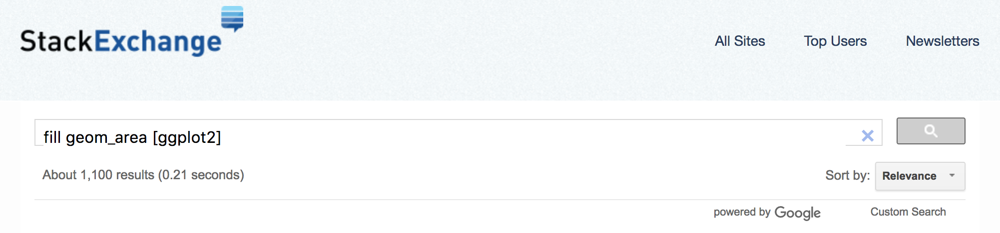

```{r xaringan-themer, include=FALSE, warning=FALSE}
library(tidyverse)
library(xaringanthemer)
style_duo_accent(primary_color = "#2A5A88", secondary_color = "#FFC631",
                 background_color = "#f8f7f3",
                 header_font_google = google_font("Archivo"),
                 text_font_google   = google_font("Inconsolata"), 
                 link_color= "#678F47"
)
```

## Recapitulación
<br>


- Manipulación de datos con tidyverse

- `tidyr` y `dplyr`

---

## Hoy hablaremos de ...
<br>

- Visualización de datos con tidyverse

- `ggplot2`

---

class: center, middle


---

class: fullscreen, left, middle, text-black
background-image: url("images/typewriter.jpg")

.huge[#ggplot2]

---
## ggplot2: un nueva forma de pensar y visualizar datos

<br>

.pull-left[
  
]

.pull-right[
`tidyr` permite:

- "Traduce" datos en elementos visuales 

]

---
## ggplot2: un nueva forma de pensar y visualizar datos

.left-column[

__Hadley Wickham__
]

.right-column[.font150[
The transferrable skills from ggplot2 are not the idiosyncracies of plotting syntax, but a powerful .bold[way of thinking] about visualisation, as a way of .bold[mapping between variables and the visual properties of geometric objects] that you can perceive.
]
.footnote[<http://disq.us/p/sv640d>]
]

--
.right-column[
<br>
`ggplot2` es un paquete enorme: filosofía + funciones
<br>... PERO está bien pensado y documentado
]


---
## Bases de datos ordenadas ("tidy") 

- El punto de partida de un gráfico en `ggplot` es una base de datos "tidy".

--

- Si los datos no existen en el formato necesario para visualizarlos, necesitamos primero "darles forma". 

--

- Hoy trabajaremos con datos de Casen 2017:

```{r, echo=FALSE, message=F, warning=F}
library("tidyverse")
library("wesanderson")
library("cowplot")
setwd(
  "~/Library/Mobile Documents/com~apple~CloudDocs/Teaching/ISUC/2020_2_data_analysis_r/repo/slides/class_5/")

# leer archivo csv
data_casen_csv <- read.csv("https://raw.githubusercontent.com/mebucca/dar_soc4001/master/data/sample_casen2017.csv")
data_casen_csv %>% glimpse()
```

```{r, echo=FALSE, message=F, warning=F}
library(ineq)
data_ineq <- data_casen_csv %>% 
  group_by(comuna,sexo) %>% 
  summarise(gini_ytot=Gini(ytotcor,na.rm = T), gini_yaut=Gini(yautcor,na.rm = T))
```

---
class: inverse, center, middle

##tidyr::ggplot2()

--

###gg es por .bold[Grammar of Graphics]

---
##Gramática visual

<br>
Adivina los datos detrás del siguiente gráfico ...


.pull-right[
```{r, echo=FALSE, fig.height=6, warning=FALSE, message=FALSE}
g <- data_ineq %>% ggplot()
g
```
]

---
##Gramática visual

<br>
Adivina los datos detrás del siguiente gráfico ...

.pull-right[
```{r, echo=FALSE, fig.height=6, warning=FALSE, message=FALSE}
g <- data_ineq %>% ggplot() +
  aes(x=gini_yaut, y=gini_ytot)
g
```
]
---
##Gramática visual

<br>
Adivina los datos detrás del siguiente gráfico ...

.pull-right[
```{r, echo=FALSE, fig.height=6, warning=FALSE, message=FALSE}
g <- data_ineq %>% ggplot() +
  aes(x=gini_yaut, y=gini_ytot) +
  geom_point()
g
```
]

---
##Gramática visual

<br>
Adivina los datos detrás del siguiente gráfico ...

.pull-right[
```{r, echo=FALSE, fig.height=6, warning=FALSE, message=FALSE}
g <- data_ineq %>% ggplot() +
  aes(x=gini_yaut, y=gini_ytot, color=factor(sexo)) +
  geom_point()
g
```
]

---
##Gramática visual

<br>
Adivina los datos detrás del siguiente gráfico ...

.pull-right[
```{r, echo=FALSE, fig.height=6, warning=FALSE, message=FALSE}
g <- data_ineq %>% ggplot() +
  aes(x=gini_yaut, y=gini_ytot, color=factor(sexo),  shape=factor(sexo)) +
  geom_point(alpha=0.5)
g
```
]

---
##Gramática visual

<br>
Adivina los datos detrás del siguiente gráfico ...

.pull-right[
```{r, echo=FALSE, fig.height=6, warning=FALSE, message=FALSE}
g <-  data_ineq %>% ggplot() +
  aes(x=gini_yaut, y=gini_ytot, color=factor(sexo),  shape=factor(sexo)) +
  geom_point(alpha=0.5) +
  labs(x="Gini Ingreso autónomo indiv.", y="Gini Ingreso total indiv.", title = "Redistribución de ingresos por región",shape = "Sexo", color = "Sexo")
g
```
]

---
##Gramática visual

<br>
Adivina los datos detrás del siguiente gráfico ...

.pull-right[
```{r, echo=FALSE, fig.height=6, warning=FALSE, message=FALSE}
g <- data_ineq %>% ggplot() +
  aes(x=gini_yaut, y=gini_ytot, color=factor(sexo),  shape=factor(sexo)) +
  geom_point(alpha=0.5) +
  geom_smooth(method = "lm", se=FALSE) +
  labs(x="Gini Ingreso autónomo indiv.", y="Gini Ingreso total indiv.", title = "Redistribución de ingresos por región",shape = "Sexo", color = "Sexo")
g
```
]

---
##Gramática visual

<br>
Adivina los datos detrás del siguiente gráfico ...

.center[
```{r, echo=FALSE, fig.height=6, fig.width=12, warning=FALSE, message=FALSE}
g <- data_ineq %>% ggplot() +
  aes(x=gini_yaut, y=gini_ytot, color=factor(sexo),  shape=factor(sexo)) +
  geom_point(alpha=0.5) +
  geom_smooth(method = "lm", se=FALSE) +
  geom_density2d(alpha=0.5) +
    labs(x="Gini Ingreso autónomo indiv.", y="Gini Ingreso total indiv.", title = "Redistribución de ingresos por región",shape = "Sexo", color = "Sexo") +
  facet_grid( . ~sexo) +
  scale_color_manual(values=wes_palette(n=2, name="Darjeeling1")) +
  theme_bw()
g
```
]

---
##Gramática visual

<br>
Adivina los datos detrás del siguiente gráfico ...

.pull-left[
```{r, warning=FALSE, message=FALSE}
data_ineq
```
]

.pull-right[
.bold[Tidy Data]

1. Una variable por .hl[columna]

2. Una observación por .hl[fila]

3. Un dato por .hl[celda]

- No siempre así 

- Si no está disponible hay que transformar los datos previamente (`dplyr` y `tidyr`)
]

---
layout: false
# ¿Como "traducir" desde datos a objetivos visuales?

La gramática de gráficos consta de los siguientes elementos:

--

.font120[
- **Datos** a visualizar
]

--
.font120[
- **.hlb[Aes]thetic mappings:** estructura visual de datos
]

--
.font120[
- **.hlb[Geom]etric objects**: indica qué se mostrará en el gráfico
]


--
.font120[
- **.hlb[Stat]istics**: transforma los datos para visualizarlos
]

--
.font120[
- **.hlb[Coord]inates:** organiza la ubicación de los objetos
]

--
.font120[
- **.hlb[Scale]s:** define el rango de los valores
]

--
.font120[
- **.hlb[Facet]s:** divide gráfico en sub-grupos
]


---
class: inverse, center, middle

##Manos a la obra con ggplot2()

---
## gg Gramática de Gráficos: data

<br>
Adivina los datos detrás del siguiente gráfico ...

.pull-left[
```{r  gg-data, eval=FALSE,warning=FALSE, message=FALSE}
data_ineq
```
]

--
.pull-right[
```{r  gg-data-out, ref.label="gg-data", echo=FALSE, warning=FALSE, message=FALSE}

```
]

---
## gg Gramática de Gráficos: `aes()`thetic mappings

<br>
Adivina los datos detrás del siguiente gráfico ...

.pull-left[
```{r  gg-aes, eval=FALSE,warning=FALSE, message=FALSE}
data_ineq %>%
ggplot(aes(x=gini_yaut, y=gini_ytot)) #<<
```
]

--
.pull-right[
```{r  gg-aes-out, ref.label="gg-aes", echo=FALSE, warning=FALSE, message=FALSE, fig.height=6}

```
]

---
## gg Gramática de Gráficos: `geom_()`etría 

<br>
Adivina los datos detrás del siguiente gráfico ...

.pull-left[
```{r  gg-geom, eval=FALSE,warning=FALSE, message=FALSE}
data_ineq %>%
ggplot(aes(x=gini_yaut, y=gini_ytot)) +
geom_point() #<<
```
]

--
.pull-right[
```{r  gg-geom-out, ref.label="gg-geom", echo=FALSE, warning=FALSE, message=FALSE, fig.height=6}

```
]

---
## gg Gramática de Gráficos: `geom_()`etría 

<br>
Adivina los datos detrás del siguiente gráfico ...

.pull-left[
```{r  gg-geom2, eval=FALSE,warning=FALSE, message=FALSE}
data_ineq %>%
ggplot(aes(x=gini_yaut, y=gini_ytot)) +
geom_line() #<<
```
]

--
.pull-right[
```{r  gg-geom2-out, ref.label="gg-geom2", echo=FALSE, warning=FALSE, message=FALSE, fig.height=6}

```
]

---
## gg Gramática de Gráficos: `geom_()`etría 

<br>
Adivina los datos detrás del siguiente gráfico ...

.pull-left[
```{r  gg-geom22, eval=FALSE,warning=FALSE, message=FALSE}
data_ineq %>%
ggplot(aes(x=gini_yaut, y=gini_ytot)) +
geom_point() + #<<
geom_line() #<<
```
]

--
.pull-right[
```{r  gg-geom22-out, ref.label="gg-geom22", echo=FALSE, warning=FALSE, message=FALSE, fig.height=6}

```
]

---
## gg Gramática de Gráficos: `geom_()`etría 

Otras opciones recurrentes:

.center[


]

---
## gg Gramática de Gráficos: `geom_()`etría 

Más opciones ...

--

.center[
.font70.center[
| Type | Function |
|:----:|:--------:|
| Point | `geom_point()` |
| Line | `geom_line()` |
| Bar | `geom_bar()`, `geom_col()` |
| Histogram | `geom_histogram()` |
| Regression | `geom_smooth()` |
| Boxplot | `geom_boxplot()` |
| Text | `geom_text()` |
| Vert./Horiz. Line | `geom_{vh}line()` |
| Count | `geom_count()` |
| Density | `geom_density()` |

<https://eric.netlify.com/2017/08/10/most-popular-ggplot2-geoms/>
]
]


---
## gg Gramática de Gráficos: `geom_()`etría 

Y aún más opciones ...

.pull-left[
.font70[
```{r ggplot2-geom-names, echo=FALSE}
# geom_
old_width = options(width = 80)
lsf.str("package:ggplot2") %>% grep("^geom_", ., value = TRUE)
options(width = old_width$width)
```
 <http://ggplot2.tidyverse.org/reference/>
]
]

--

.img-right[

Or just start typing `geom_` in RStudio
]

---
## gg Gramática de Gráficos: más sobre `aes()`thetic mappings


.pull-left[
```{r  gg-aes3, eval=FALSE,warning=FALSE, message=FALSE}
data_ineq %>%
ggplot(aes(x=gini_yaut, y=gini_ytot)) + #<<
geom_point()
```
]

--
.pull-right[
```{r  gg-aes3-out, ref.label="gg-aes3", echo=FALSE, warning=FALSE, message=FALSE, fig.height=6}

```
]

---
## gg Gramática de Gráficos: más sobre `aes()`thetic mappings


.pull-left[
```{r  gg-aes4, eval=FALSE,warning=FALSE, message=FALSE}
data_ineq %>%
ggplot(
  aes(x=gini_yaut, y=gini_ytot, 
      colour="red")) + #<<
geom_point()
```
]

--
.pull-right[
```{r  gg-aes4-out, ref.label="gg-aes4", echo=FALSE, warning=FALSE, message=FALSE, fig.height=6}

```
]

---
## gg Gramática de Gráficos: más sobre `aes()`thetic mappings


.pull-left[
```{r  gg-aes5, eval=FALSE,warning=FALSE, message=FALSE}
data_ineq %>%
ggplot(
  aes(x=gini_yaut, y=gini_ytot, 
      colour=sexo)) + #<<
geom_point()
```
]

--
.pull-right[
```{r  gg-aes5-out, ref.label="gg-aes5", echo=FALSE, warning=FALSE, message=FALSE, fig.height=6}

```
]

---
## gg Gramática de Gráficos: más sobre `aes()`thetic mappings


.pull-left[
```{r  gg-aes6, eval=FALSE,warning=FALSE, message=FALSE}
data_ineq %>%
ggplot(
  aes(x=gini_yaut, y=gini_ytot, 
      colour= factor(sexo) )) + #<<
geom_point()
```
]

--
.pull-right[
```{r  gg-aes6-out, ref.label="gg-aes6", echo=FALSE, warning=FALSE, message=FALSE, fig.height=6}

```
]

---
## gg Gramática de Gráficos: más sobre `aes()`thetic mappings


.pull-left[
```{r  gg-aes7, eval=FALSE,warning=FALSE, message=FALSE}
data_ineq %>%
ggplot(
  aes(x=gini_yaut, y=gini_ytot, 
      colour= factor(sexo), #<<
      shape=factor(sexo))) + #<<
geom_point() 
```
]

--
.pull-right[
```{r  gg-aes7-out, ref.label="gg-aes7", echo=FALSE, warning=FALSE, message=FALSE, fig.height=6}

```
]

---
## gg Gramática de Gráficos: más sobre `aes()`thetic mappings


.pull-left[
```{r  gg-aes8, eval=FALSE,warning=FALSE, message=FALSE}
data_ineq %>%
ggplot(
  aes(x=gini_yaut, y=gini_ytot, 
      group = factor(sexo), #<<
      colour = factor(sexo),   
      shape = factor(sexo))) +
geom_point()  +
geom_smooth(se=F)  #<<

```
]

--

.pull-right[
```{r  gg-aes8-out, ref.label="gg-aes8", echo=FALSE, warning=FALSE, message=FALSE, fig.height=6}

```
]

---
## gg Gramática de Gráficos: más sobre `aes()`thetic mappings


.pull-left[
```{r  gg-aes9, eval=FALSE,warning=FALSE, message=FALSE}
data_ineq %>%
ggplot(
  aes(x=gini_yaut, y=gini_ytot, 
      group = factor(sexo), 
      colour = factor(sexo),   
      shape = factor(sexo))) +
geom_point()  +
geom_smooth(se=F) + 
labs(x="Gini Ingreso autónomo indiv.",  #<<
     y="Gini Ingreso total indiv.", #<<
     title = "Redistribución de ingresos por región", #<<
     shape = "Sexo",#<<
     color = "Sexo") #<<
```
]

--

.pull-right[
```{r  gg-aes9-out, ref.label="gg-aes9", echo=FALSE, warning=FALSE, message=FALSE, fig.height=6}

```
]

---
class: fullscreen,left, top, top, text-azzurro
background-image: url("images/bicicleta.jpg")

.huge[#R se aprende]
.huge[#usando y]
.huge[#preguntando]

---



---
class: inverse, middle

Presentación y código en GitHub: <https://github.com/mebucca/dar_soc4001>

---
class: inverse, center, middle


##Gracias!


<br>
Mauricio Bucca <br>
https://mebucca.github.io/ <br>
github.com/mebucca


