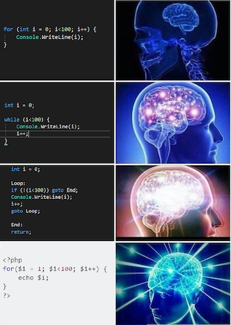
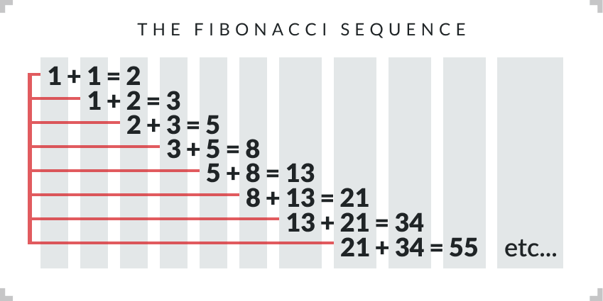
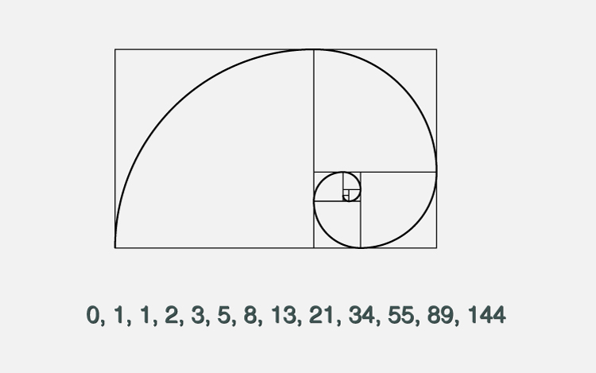

```{r xaringan-themer, include=FALSE, warning=FALSE}
library(tidyverse)
library(xaringanthemer)
style_duo_accent(primary_color = "#129588", secondary_color = "#83C689",
                 background_color = "#f8f7f3",
                 header_font_google = google_font("Archivo"),
                 text_font_google   = google_font("Inconsolata"), 
                 link_color= "#FFFFA2"
)
```


## Recapitulación
<br>

- Manipulación de bases de datos con `tidyr` y `dplyr`

- Visualización de datos con `ggplot2`


---

## Hoy hablaremos de ...

Iteración y automatización: 

  - Loops
  
  - "Functional programming"

---
class: fullscreen, left, middle, text-black
background-image: url("images/typewriter.jpg")

.huge[#Loops]

---
## Loops: ¿para que?

.pull-left[

]

.pull-right[
Explorar patrones comunes en código para:

<br>

- Reducir .bold[duplicación] de código 

- Reducir posibilidades de .bold[errores] en código

- Automatizar .bold[análisis] 

- Automatizar .bold[almacenamiento y extracción] de resultados

]

---
## Loops: ¿para que?

.pull-left[

- Hay muchos tipos de loops.


]

.pull-right[

]


---
## `for` loops

Con números

.pull-left[
```{r forloop1, eval=FALSE}

for(i in 1:20) {
  
  primo <- i + (i-1)
  print(primo)

  }
```
]

--
.pull-right[
```{r forloop1-out, ref.label="forloop1", echo=FALSE}
```
]


---
## `for` loops

Con letras

.pull-left[
```{r forloop2, eval=FALSE}

for(j in c("Tamara","Julio","Simona")) { #<<
  
  frase <- paste0(j, " participa en clases")
  print(frase)
  
  }
```
]

--
.pull-right[
```{r forloop2-out, ref.label="forloop2", echo=FALSE}
```
]

--

.pull-left[
```{r forloop3, eval=FALSE}

nombres <- c("Tamara","Julio","Simona")

for(n in nombres) { #<<
  
  frase <- paste0(n, " participa en clases")
  print(frase)
  
  }
```
]

--
.pull-right[
```{r forloop3-out, ref.label="forloop3", echo=FALSE}
```
]

```{css, echo=FALSE}
.pull-right ~ * { clear: unset; }
.pull-right + * { clear: both; }
```

---
## Nested Loops

.pull-left[
```{r forloop31, eval=FALSE}

for (i in  1:5) { #<<
  for (j in c(3,4)) { #<<
    
  diff = i - j
  print(diff) 
  
  }
}
```
]

--
.pull-right[
```{r forloop31-out, ref.label="forloop31", echo=FALSE}
```
]

--

.pull-left[
```{r forloop32, eval=FALSE}

for (j in c(3,4)) { #<<
  for (i in  1:5) { #<<

  diff = i - j
  print(diff) 
  
  }
}
```
]

--
.pull-right[
```{r forloop32-out, ref.label="forloop32", echo=FALSE}
```
]

```{css, echo=FALSE}
.pull-right ~ * { clear: unset; }
.pull-right + * { clear: both; }
```

---

## Estructuras de control

`if`, `else if`, `else`


.pull-left[
```{r forloop4, eval=FALSE}

a <- 49

if(a > 100){ #<<
  
  print(":(")

} else if (a < 50){ #<<
  
  print(":)")

  } else { #<<
    
  print(":S")

  }

```
]

--
.pull-right[
```{r forloop4-out, ref.label="forloop4", echo=FALSE}
```
]

---
## Estructuras de control + loops

.pull-left[

]


.pull-right[

]

---
## Estructuras de control + loops + almacenamiento

.pull-left[
$$\begin{align}
f_n = \begin{cases}
n \quad & \text{si } n \in 0,1 \\ \\
f_{n-2} + f_{n-1} \quad & \text{si } n > 1 
\end{cases}
\end{align}$$
]

.pull-right[

]

--

.pull-left[
```{r forloop5, eval=FALSE}
f <- NULL #<<
for (n in 0:12) {
  
  if (n == 0 | n == 1) { #<<
    f[n+1] <- n #<<
    print(f)
  }
  
  else if (n > 1){ #<<
    f[n+1] <- f[(n+1)-1] + f[(n+1)-2] #<<
    print(f)
  }

}
```
]

--

.pull-right[
```{r forloop5-out, ref.label="forloop5", echo=FALSE}
```
]

```{css, echo=FALSE}
.pull-right ~ * { clear: unset; }
.pull-right + * { clear: both; }
```

---
## `while` loops


.pull-left[
```{r while1, eval=FALSE}

j=0
while (j < 1000000000) { #<<
    print(j)
    j=(j+1)^2 #<<
}
```
]

--
.pull-right[
```{r while1-out, ref.label="while1", echo=FALSE}
```
]

--
.bold[Cuidado!]

.pull-left[
```{r, eval=FALSE}
j=1
while (j < 2) { #<<
  j = j/j 
}
```
]

.pull-right[

]
```{css, echo=FALSE}
.pull-right ~ * { clear: unset; }
.pull-right + * { clear: both; }
```

---
class: inverse, center, middle

## Loops: algunas aplicaciones para análisis de datos

---
## Datos Covid-19

Continuaremos trabajando con datos mundiales de COVID (OWID):

```{r, echo=FALSE, message=F, warning=F}
library("tidyverse")
library("broom")
library("viridis")


setwd(
  "~/Library/Mobile Documents/com~apple~CloudDocs/Teaching/ISUC/2020_2_data_analysis_r/repo/slides/class_12/")

# leer archivo csv
covid_data <- read_delim("covid_data.csv", delim=";")

covid_data <- covid_data %>% filter(date==as.Date("2020-11-17")) 
covid_data  %>% glimpse()

```

---
## Análisis de datos Covid-19, manualmente

- Variables dependientes (y): `total_cases_per_million`, `total_deaths_per_million`

- Predictores (x): `population_density` `median_age`, `gdp_per_capita`

<br>

.bold[Instrucciones]:

1. Crea un scatterplot de cada (y) con cada x

2. Regresiona cada (y) con cada (x)

3. Extrae el $R^2$ de cada modelo
  

---
## Análisis de datos Covid-19, manualmente

- Variables dependientes (y): `total_cases_per_million`, `total_deaths_per_million`

- Predictores (x): `population_density` `median_age`, `gdp_per_capita`

<br>

.bold[Instrucciones]:

1. Regresiona cada (y) con cada (x), guarda el modelo

2. Extrae el $R^2$ de cada modelo


<br>
--

```{r, eval=F}
lm1 <- lm(total_cases_per_million ~ population_density, data=covid_data) #<<
r2_1 <- summary(lm1)$r.squared #<<

lm2 <- lm(total_cases_per_million ~ median_age, data=covid_data)
r2_2 <- summary(lm2)$r.squared

... ETC, ETC, ETC, ETC!!! #<<

```

---
## Análisis de datos Covid-19 usando loops

.bold[Instrucciones]:

1. Regresiona cada (y) con cada (x), guarda el modelo
2. Extrae el $R^2$ de cada modelo

<br>
--

```{r, eval=FALSE}
for (dv in c("total_cases_per_million", "total_deaths_per_million")) {
  for (iv in  c("population_density", "median_age", "gdp_per_capita")) {
    
    #ajusta modelo
    y <- covid_data[,dv] %>% as.matrix()
    x <- covid_data[,iv] %>% as.matrix()
    mimodelo <- lm(y ~ x) #<<
   
    #r2 
    mir2 <- summary(mimodelo)$r.squared; print(mir2) #<<
  }
}
```
---
## Análisis de datos Covid-19 usando loops

.bold[Instrucciones]:

1. Regresiona cada (y) con cada (x), guarda el modelo
3. Extrae el $R^2$ de cada modelo

<br>

```{r, echo=FALSE}
for (dv in c("total_cases_per_million", "total_deaths_per_million")) {
  for (iv in  c("population_density", "median_age", "gdp_per_capita")) {
    
    #ajusta modelo
    y <- covid_data[,dv] %>% as.matrix()
    x <- covid_data[,iv] %>% as.matrix()
    mimodelo <- lm(y ~ x)
   
    #r2 
    mir2 <- summary(mimodelo)$r.squared ; print(mir2) 
  }
}
```

---
## Análisis de datos Covid-19 usando loops + almacenamiento resultados via `assign()`

```{r, eval=FALSE}
for (dv in c("total_cases_per_million", "total_deaths_per_million")) {
  for (iv in  c("population_density", "median_age", "gdp_per_capita")) {
    
    #ajusta modelo
    y <- covid_data[,dv] %>% as.matrix()
    x <- covid_data[,iv] %>% as.matrix()
    mimodelo <- lm(y ~ x)
    namemodelo <- paste("lm_",dv,"_",iv) #<<
    assign(namemodelo,mimodelo ) #<<
      
    #r2 
    mir2 <- summary(mimodelo)
    namer2 <- paste("r2_",dv,"_",iv) #<<
    assign(namer2,mir2) #<<

  }
}
```

---
## Análisis de datos Covid-19 usando loops 


.pull-left[

]
.pull-right[
.bold[Ahora hagamos estos análisis por separado para cada continente ...]
]

<br>
--

2 variables dependientes, 3 variables independientes, 2 análisis distintos, 6 continentes = ...

--

.bold[48 repeticiones] de los mismo ...

--

Una posible solución: agregar un nivel adicional al loop (continentes)

---
class: fullscreen, left, middle, text-black
background-image: url("images/typewriter.jpg")

.huge[#Breve]
.huge[#intro]
.huge[#ducción]
.huge[#a purrr]


---
class: center, middle


---
## purrr: funciones para iteración 

<br>

.pull-left[
  
]

.pull-right[

- Iteración

- Herramientas de "functional programming" 

]


---
## purrr: `map()`

La función básica de `purrr` es `map()`:  aplica la misma acción/función a cada elemento de un objeto.

<br>

.bold[Input]:

- un vector

- una lista

- una base de datos

<br>
--

.bold[Output]:


- `map(.x, .f)` devuelve una lista

- `map_df(.x, .f)` devuelve una base de datos

- `map_dbl(.x, .f)` devuelve un número


---
## purrr: `map()`

.pull-left[
```{r purrr1, eval=FALSE}
mydata <- tibble(x=rnorm(30),y=rnorm(30))
mydata %>% head()
```
]

.pull-right[
```{r purrr1-out, ref.label="purrr1", echo=FALSE}
```
]


--

.pull-left[
```{r purrr2, eval=FALSE}
sum_plus10 <- function(x) {sum(x) + 10}

map(.x=mydata, .f=sum_plus10 ) #<<
```
]

--
.pull-right[
```{r purrr2-out, ref.label="purrr2", echo=FALSE}
```
]


```{css, echo=FALSE}
.pull-right ~ * { clear: unset; }
.pull-right + * { clear: both; }
```

---
## purrr: `map()`

.pull-left[
```{r purrr3, eval=FALSE}
mydata <- tibble(x=rnorm(30),y=rnorm(30))
mydata %>% head()
```
]

.pull-right[
```{r purrr3-out, ref.label="purrr3", echo=FALSE}
```
]


--

.pull-left[
```{r purrr4, eval=FALSE}
sum_plus10 <- function(x) {sum(x) + 10}

map_df(.x=mydata, .f=sum_plus10 ) #<<
```
]

--
.pull-right[
```{r purrr4-out, ref.label="purrr4", echo=FALSE}
```
]


```{css, echo=FALSE}
.pull-right ~ * { clear: unset; }
.pull-right + * { clear: both; }
```

---
## purrr: `map()`

.pull-left[
```{r purrr5, eval=FALSE}
mydata <- tibble(x=rnorm(30),y=rnorm(30))
mydata %>% head()
```
]

.pull-right[
```{r purrr5-out, ref.label="purrr5", echo=FALSE}
```
]


--

.pull-left[
```{r purrr6, eval=FALSE}

map_df(.x=mydata, .f= ~ sum(.x) + 10  ) #<<
```
]

--
.pull-right[
```{r purrr6-out, ref.label="purrr6", echo=FALSE}
```
]


```{css, echo=FALSE}
.pull-right ~ * { clear: unset; }
.pull-right + * { clear: both; }
```


---
## Análisis de datos Covid-19 con `purrr`

Volviendo a nuestro problema inicial:

- Variables dependientes (y): `total_cases_per_million`, `total_deaths_per_million`

- Predictores (x): `population_density` `median_age`, `gdp_per_capita`


<br>
--


.bold[Instrucciones]: Regresiona cada (y) con cada (x) y guarda el modelo, luego extrae el $R^2$ de cada modelo, 

Un modelo regresión por continente:

--

.pull-left[
```{r purrr7, eval=FALSE, warning=F} 

fit_lm <- covid_data  %>% nest(-continent) %>%
  mutate(
    fit = map(data, ~ lm(total_cases_per_million ~ median_age, data = .x)) #<<
  ) 
fit_lm
```
]


--
.pull-right[
```{r purrr7-out, ref.label="purrr7", echo=FALSE,  warning=F}
```
]

---
## Análisis de datos Covid-19 con `purrr`


.bold[Instrucciones]: Regresiona cada (y) con cada (x) y guarda el modelo, luego extrae el $R^2$ de cada modelo, 

Ahora .bold[extraemos] los coefficientes del modelo con la función `broom::tidy()`

--

```{r purrr9, eval=FALSE, warning=F} 
fit_lm <- fit_lm %>% mutate(coefs = map(fit, tidy)) #<<
fit_lm
```


--

```{r purrr9-out, ref.label="purrr9", echo=FALSE,  warning=F}
```

---
## Análisis de datos Covid-19 con `purrr`


.bold[Instrucciones]: Regresiona cada (y) con cada (x) y guarda el modelo, luego extrae el $R^2$ de cada modelo, 

Ahora .bold[extraemos] los coefficientes del modelo con la función `broom::tidy()`

--

```{r purrr91, eval=FALSE, warning=F} 
fit_lm <- fit_lm %>% mutate(coefs = map(fit, tidy))
fit_lm %>% select(continent,coefs) %>% unnest() #<<
```


--

```{r purrr91-out, ref.label="purrr91", echo=FALSE,  warning=F}
```

---
## Análisis de datos Covid-19 con `purrr`


- Nuestro código sólo considera las variables  `total_cases_per_million` y  `median_age`.

--


- .bold[Problema:] ¿Como hacemos para iterar sobre par (x)-(y) de variables dependientes e independientes? 


<br>
--

```{r purrr92, eval=FALSE, warning=F} 

covid_data <- covid_data %>% 
  dplyr::select(continent,location,total_cases_per_million, #<<
                total_deaths_per_million, population_density,median_age, gdp_per_capita) %>%
  pivot_longer(c(total_cases_per_million,total_deaths_per_million), #<<
               names_to="dv", values_to="y") %>% 
   pivot_longer(c(population_density,median_age,gdp_per_capita), #<<
                names_to="iv", values_to="x")  

covid_data
```


---
## Análisis de datos Covid-19 con `purrr`


```{r purrr92-out, ref.label="purrr92", echo=FALSE,  warning=F}
```

---
## Análisis de datos Covid-19 con `purrr`


```{r purrr93, eval=FALSE, warning=F} 

fit_lm <- covid_data %>% nest(-c(continent,dv,iv)) %>% #<<
  mutate(
    fit = map(data, ~ lm(y ~ x, data = .x))
  ) 
fit_lm
```

```{r purrr93-out, ref.label="purrr93", echo=FALSE,  warning=F}
```
---
## Análisis de datos Covid-19 con `purrr`


```{r purrr94, eval=FALSE, warning=F} 

fit_lm <- covid_data %>% nest(-c(continent,dv,iv)) %>%
  mutate(fit = map(data, ~ lm(y ~ x, data = .x))) %>% 
  mutate(coefs = map(fit, tidy)) #<<
  
fit_lm
```

```{r purrr94-out, ref.label="purrr94", echo=FALSE,  warning=F}
```

---
## Análisis de datos Covid-19 con `purrr`


```{r purrr95, eval=FALSE, warning=F} 

fit_lm <- covid_data %>% nest(-c(continent,dv,iv)) %>%
  mutate(fit = map(data, ~ lm(y ~ x, data = .x))) %>% 
  mutate(coefs = map(fit, tidy)) %>% 
  dplyr::select(continent,dv,iv,coefs) %>% #<<
  unnest() #<<
  
fit_lm
```

```{r purrr95-out, ref.label="purrr95", echo=FALSE,  warning=F}
```

---
## Análisis de datos Covid-19 con `purrr`


```{r purrr96, eval=FALSE, warning=F, fig.height=5, fig.width=10} 

fit_lm %>% filter(term=="x") %>%   #<<
  ggplot(aes(x=continent, y=estimate, fill=continent)) +   #<<
  geom_col() + facet_wrap(dv ~ iv, scales="free_y") +
  scale_fill_viridis_d() +
  theme_bw()

```

```{r purrr96-out, ref.label="purrr96", echo=FALSE,  warning=F, fig.height=5, fig.width=10}
```


---

class: fullscreen,left, top, top, text-azzurro
background-image: url("images/bicicleta.jpg")

.huge[#R se aprende]
.huge[#usando y]
.huge[#preguntando]

---


---
class: inverse, middle

Presentacióny código en GitHub: <https://github.com/mebucca/data-analysis-in-R>

---
class: inverse, center, middle


##Gracias!

<br>
Mauricio Bucca <br>
https://mebucca.github.io/ <br>
github.com/mebucca


