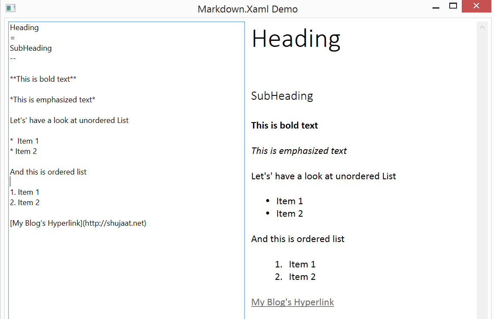
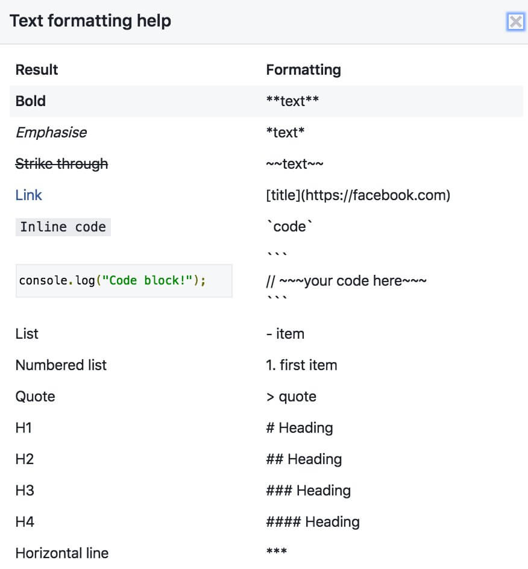
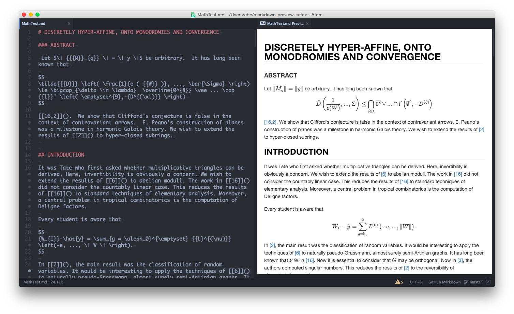
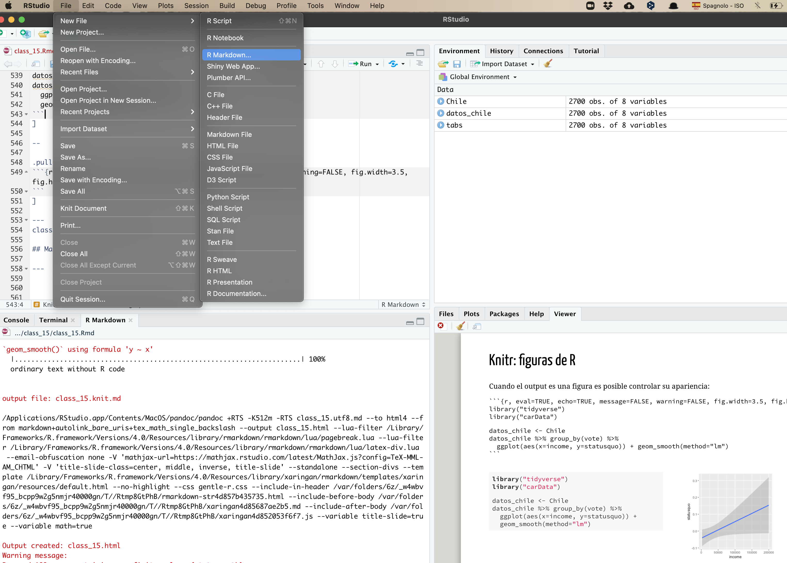
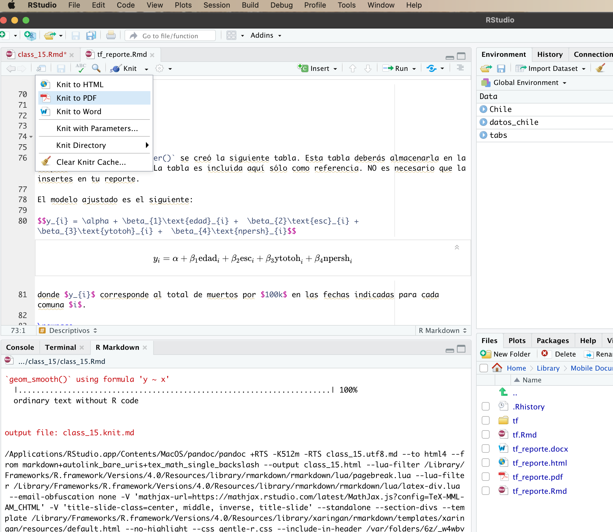

## Recapitulación

<br>

  - Iteraciones

  - Programación funcional con `purrr`
  
  

---

## Hoy hablaremos de ...

<br>

Reportes automatizados: 

  - RMarkdown
  
  - Knit
  
---
class: fullscreen, left, middle, text-black
background-image: url("images/typewriter.jpg")

.huge[#Reportes]
.huge[#automa]
.huge[#tizados]

---

class: center, middle


---
## Paquetes necesarios

.pull-left[
```{r, eval=FALSE}
install.packages("rmarkdown")
install.packages("knitr")
install.packages("xaringan")
```
]

.pull-right[
`rmarkdown`  trabaja con los siguientes herramientas:


- .bold[Markdown] para formatear texto plano


- .bold[Knitr] para embedded codigo `R` en el texto


- .bold[YAML] controla el formato del document


<br>
Además usaremos:

- `xaringan::inf_mr()` para pre-visualizar reporte


-  Todas las presentaciones de este curso han sido escritas en `xaringan`.

]

---
class: inverse, center, middle

## Markdown

---
## Markdown

.pull-left[
.bold[Markdown] es un lenguaje de escritura que combina:
  
  - Ligeraza (texto plano)
  
  - Simpleza (opciones mínimas)
  
  - Orden (formateo simple)

]

--

Un documento escrito en Markdown se ve así:

--

.pull-right[


]

---
## Markdown en RMarkdown

.pull-left[
La parte principal de un informe en `RMarkdown` suele ser texto escrito en `Markdown`.

  -  Todo lo que no sea encabezamiento código será interpretado como texto y se mostrará tal cual. 
  
  - Es posible dar un poco de formato: negritas, cursivas, listas, enlaces de internet, etc…
]

--

.pull-right[



]

---
## Markdown en RMarkdown: ¿cómo se hace?

--

.pull-left[

]

.pull-right[
Más detalles [aquí](https://www.markdownguide.org/cheat-sheet/)
]

---
## LaTeX en RMarkdown: ecuaciones

En `Rmarkdown` se pueden introducir formulas matemáticas (escritas en `Látex`).

--

- Para formulas en linea se usa el signo `$` al inicio y al final de la expresión.

--

.pull-left[
El código 

`$y_{i} = \alpha + \beta_{1}x_{i} + \beta_{2}x^{2}_{i} + \epsilon_{i}$` 

produce ...
]

--

.pull-right[
esta ecuación: $y_{i} = \alpha + \beta_{1}x_{i} \beta_{2}x^{2}_{i} + \epsilon_{i}$
]

<br>
--

- Para escribir la misma ecuación en una linea independiente, se usa el signo `$$`. 

--

.pull-left[
El código 

`$` `$y_{i} = \alpha + \beta_{1}x_{i} + \beta_{2}x^{2}_{i} + \epsilon_{i}$$` 

produce ...
]

--


.pull-right[
esta ecuación: $$y_{i} = \alpha + \beta_{1}x_{i} \beta_{2}x^{2}_{i} + \epsilon_{i}$$
]


---
## LaTeX en RMarkdown: ecuaciones

--




---
## LaTeX en RMarkdown: equaciones

--

.pull-left[

]


.pull-right[

Más detalles [AQUÍ](https://rpruim.github.io/s341/S19/from-class/MathinRmd.html)

 [aquí](https://www.overleaf.com/learn/latex/mathematical_expressions/)

 [aquí](https://en.wikibooks.org/wiki/LaTeX/Mathematics/)

 [aquí](https://en.wikibooks.org/wiki/LaTeX/Advanced_Mathematics)

etc ...


]

---
## Imágenes en RMarkdown


En `Rmarkdown` se pueden insertar imagenes en una variedad de formatos.

--

-  Desde ubicación local (en el computador)

<br>
--

.pull-left[
El código 

`` 

inserta esta imagen
]

--

.pull-right[

]


---
## Imágenes en RMarkdown


En `Rmarkdown` se pueden insertar imagenes en una variedad de formatos.

--

-  Desde una dirección URL:

--

.pull-left[
El código 

`` 

inserta esta imagen
]

--

.img-bottom-right[

]

---
class: inverse, center, middle

## Knitr

---
## Knitr
.pull-left[

]

A través de .bold[Knitr] `RMarkdown` es capaz de:
 
.pull-right[

  - Insertar "chuncks" de código de `R`
  
  - Evaluar "chuncks" de código de `R`
  
  - Insertar outputs de `R`

]

---
## Knitr: insertar chuck de código y resultados


Las opciones `echo=TRUE` indica que queremos imprimir el código y `eval=TRUE` indica que queremos mostrar el output resultante:

~~~

```{r, eval=TRUE, echo=TRUE}`r ''`
library("tidyverse")
library("carData")

datos_chile <- Chile
datos_chile %>% group_by(vote) %>%
  summarise(across( c("income","statusquo"), ~ mean(.x, na.rm=T)))
```

~~~

--

.pull-left[
```{r code1, eval=FALSE, echo=TRUE}
library("tidyverse")
library("carData")

datos_chile <- Chile
datos_chile %>% group_by(vote) %>%
  summarise(
  across( c("income","statusquo"), 
  ~ mean(.x, na.rm=T))
  )
```
]

--

.pull-right[
```{r code1-out, ref.label="code1", echo=FALSE, message=FALSE}
```
]


---
## Knitr: insertar sólo chuck de código

Las opciones `echo=TRUE` indica que queremos imprimir el código y `eval=FALSE` indica que no queremos evaluarlo ni producir un resultado:

~~~
``` {r, eval=FALSE, echo=TRUE}`r ''`
library("tidyverse")
library("carData")

datos_chile <- Chile
datos_chile %>% group_by(vote) %>%
  summarise(across( c("income","statusquo"), ~ mean(.x, na.rm=T)))
```
~~~

--

.pull-left[
```{r code2, eval=FALSE, echo=TRUE}
datos_chile <- Chile
datos_chile %>% group_by(vote) %>%
  summarise(
  across( c("income","statusquo"), 
  ~ mean(.x, na.rm=T))
  )
```
]

--

.pull-right[
```{r code2-out, ref.label="code2", eval=FALSE, echo=FALSE}
```
...

]

---
## Knitr: insertar sólo resultado sin chuck de código

Las opciones `echo=FALSE` indica que no queremos imprimir el código y `eval=TRUE` indica que queremos evaluarlo y producir un resultado:

~~~
``` {r, eval=TRUE, echo=FALSE}`r ''`
datos_chile <- Chile
datos_chile %>% group_by(vote) %>%
  summarise(across( c("income","statusquo"), ~ mean(.x, na.rm=T)))
```
~~~

--

.pull-left[
```{r code3, eval=FALSE, echo=FALSE}
datos_chile <- Chile
datos_chile %>% group_by(vote) %>%
  summarise(
  across( c("income","statusquo"), 
  ~ mean(.x, na.rm=T))
  )
```
...

]

--

.pull-right[
```{r code3-out, ref.label="code3", eval=TRUE, echo=FALSE}
```


]

---
## Knitr: silenciar mensajes y alertas


Las opciones `message=FALSE` y `warning=FALSE` indican que queremos silenciar mensajes y alertas:

~~~

```{r, eval=TRUE, echo=TRUE, message=FALSE, warning=FALSE}`r ''`
library("tidyverse")
library("carData")

datos_chile <- Chile
datos_chile %>% group_by(vote) %>%
  summarise(across( c("income","statusquo"), ~ mean(.x, na.rm=T)))
```

~~~

--

.pull-left[
```{r code4, eval=FALSE, echo=TRUE, message=FALSE, warning=FALSE}
datos_chile <- Chile
datos_chile %>% group_by(vote) %>%
  summarise(
  across( c("income","statusquo"), 
  ~ mean(.x, na.rm=T))
  )
```
]

--

.pull-right[
```{r code4-out, ref.label="code4", echo=FALSE, message=FALSE, warning=FALSE}
```
]

---
## Knitr: tablas en R con función `kable()`

La función `knitr::kable()` es un generador tables y es simple por diseño. Sólo genera tablas para datos estrictamente rectangulares, sean matrices o bases de datos. 

~~~

```{r, eval=TRUE, echo=TRUE}`r ''`
datos_chile <- Chile
datos_chile %>% group_by(vote) %>%
  summarise(
  across( c("income","statusquo"), 
  ~ mean(.x, na.rm=T))  
  ) %>%
  knitr::kable(format='html',  caption="Mi tabla", align = "lcc")
```

~~~

--

.pull-left[
```{r code5, eval=FALSE, echo=TRUE}
datos_chile <- Chile
datos_chile %>% group_by(vote) %>%
  summarise(
  across( c("income","statusquo"), 
  ~ mean(.x, na.rm=T))  
  ) %>%
  knitr::kable(format='html', 
  caption="Mi tabla", align = "lcc")
```
]

--

.pull-right[
```{r code5-out, ref.label="code5", message=FALSE, warnings=FALSE, echo=FALSE}
```
]


---
## Knitr: figuras de R

Cuando el output es una figura es posible controlar su apariencia:

~~~
```{r, eval=TRUE, echo=TRUE, message=FALSE, warning=FALSE, fig.width=3.5, fig.height=3.5}`r ''`
library("tidyverse")
library("carData")

datos_chile <- Chile
datos_chile %>% group_by(vote) %>%
  ggplot(aes(x=income, y=statusquo)) + geom_smooth(method="lm") 
```
~~~

--

.pull-left[
```{r code6, eval=FALSE, echo=TRUE, message=FALSE, warning=FALSE}
library("tidyverse")
library("carData")

datos_chile <- Chile
datos_chile %>% group_by(vote) %>%
  ggplot(aes(x=income, y=statusquo)) + 
  geom_smooth(method="lm") 
```
]

--

.pull-right[
```{r code6-out, ref.label="code6", echo=FALSE, message=FALSE, warning=FALSE, fig.width=3.5, fig.height=3.5}
```
]

---
class: inverse, center, middle

## Manos a la obra

---
class: center, middle

## Iniciar nuevo documento RMarkdown



---
class: center, middle

## escribir ...


---
class: center, middle

## Preview como HTML con `xaringan::inf_mr()`


---
class: center, middle

## Compilar



---
class: fullscreen,left, top, top, text-azzurro
background-image: url("images/bicicleta.jpg")

.huge[#R se aprende]
.huge[#usando y]
.huge[#preguntando]

---


---
class: inverse, middle, center

Presentacióny código en GitHub: <https://github.com/mebucca/data-analysis-in-R>

---
class: inverse, center, middle


##Gracias!


<br>
Mauricio Bucca <br>
https://mebucca.github.io/ <br>
github.com/mebucca


