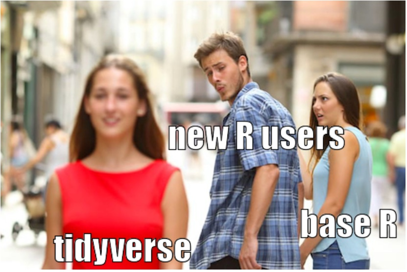
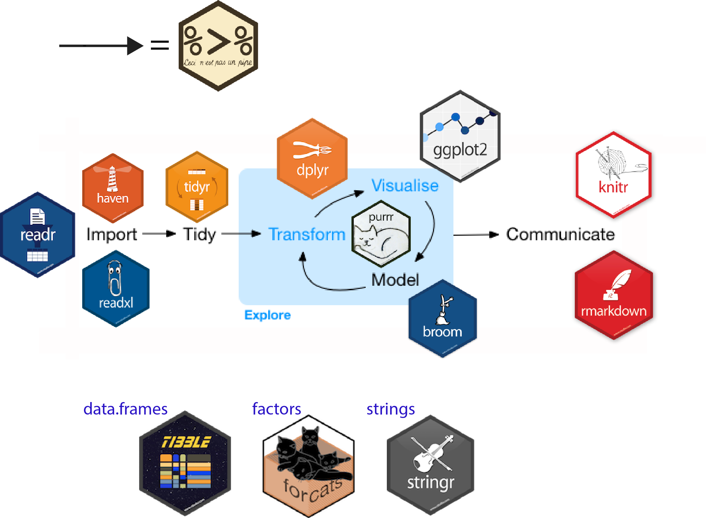
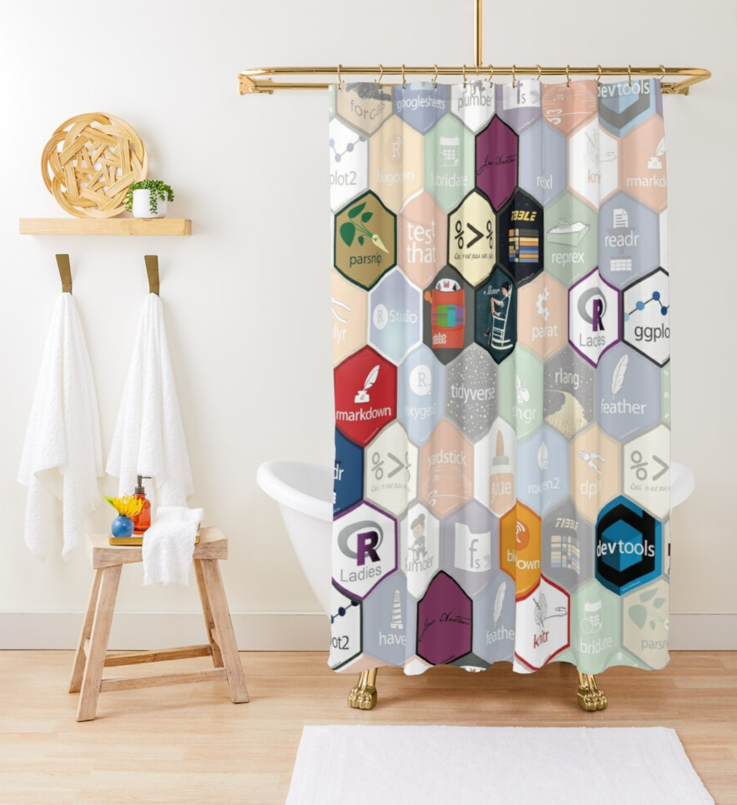
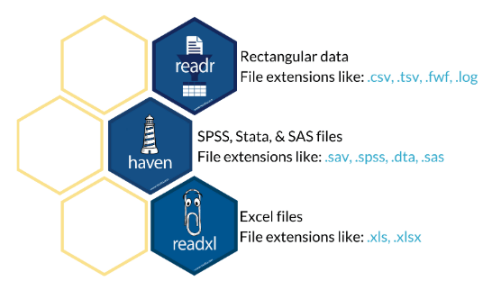
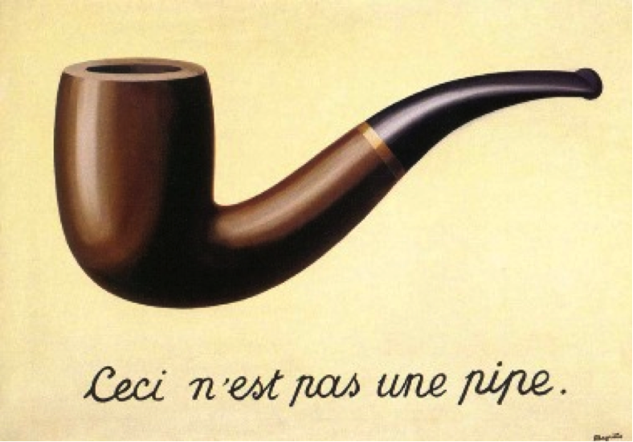
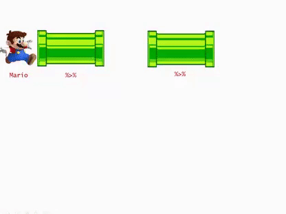
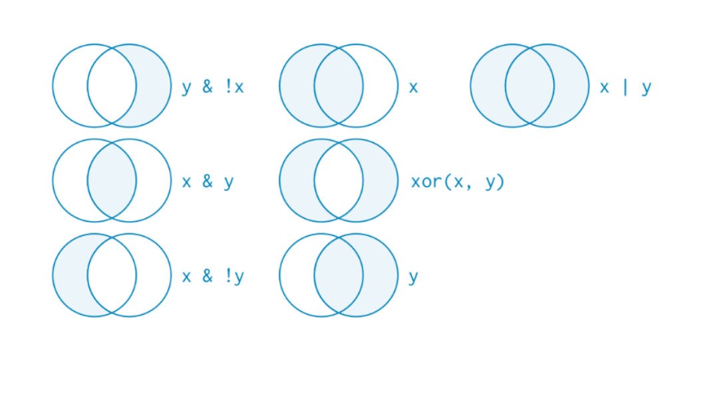
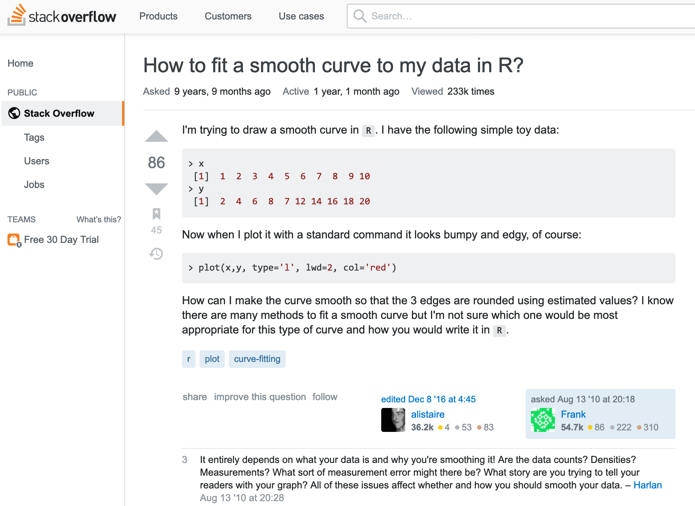

## Recapitulación
<br>

- Funciones basales de R

- Manipulación de datos

- Workflow en R

```{r xaringan-themer, include=FALSE, warning=FALSE}
library(tidyverse)
library(xaringanthemer)
style_duo_accent(primary_color ="#E2725B", secondary_color ="#0077BE",
                 background_color = "#f8f7f3",
                 header_font_google = google_font("Archivo"),
                 text_font_google   = google_font("Inconsolata"), 
                 link_color= "#FFD300"
)
```


---

## Hoy hablaremos de ...

- Universo `tidyverse`

  - Importar datos con `readr`
  
  - Bases de datos "modernas" con `tibble`
  
  - ordenar, seleccionar, filtrar con`dplyr`


---
class: fullscreen, left, middle, text-black
background-image: url("images/typewriter.jpg")

#tidy
#verse

---
## Tidyverse y R-base

.center[]

---
## Universo tidyverse


.center[]


---
## El creador

.pull-left[
Hadley Wickham

]

--

.pull-right[
Los usuarios lo agradecen ...

]

---
## tidyverse, un modo de vida


.pull-left[

]

--

.pull-right[

]


---
class: fullscreen, left, middle, text-black
background-image: url("images/typewriter.jpg")

.huge[#Importar]
.huge[#datos]


---


## readr, haven, readxl y más



---

## readr: cargar archivos .cvs

```{r, message=FALSE}
library("readr") 

setwd("/Users/Mauricio/Library/Mobile Documents/com~apple~CloudDocs/Teaching/ISUC/2023_2_data_analysis_r/repo/slides/class_5")

# leer archivo csv
data_casen_csv <- read_csv("sample_casen2017.csv")
```

--

```{r, message=FALSE, echo=FALSE}
head(as.data.frame(data_casen_csv),4)
```

---

## readr: cargar archivos .dta (Stata)

```{r, message=FALSE}
library("haven") 

setwd(
  "/Users/Mauricio/Library/Mobile Documents/com~apple~CloudDocs/Teaching/ISUC/2023_2_data_analysis_r/repo/slides/class_5"
  )

# leer archivo dta 
data_casen_dta <- read_dta("sample_casen2017.dta", encoding = "latin1", .name_repair = "minimal")
```

--

```{r, message=FALSE, echo=FALSE}
head(as.data.frame(data_casen_dta),4)
```

---
class: fullscreen, left, middle, text-black
background-image: url("images/typewriter.jpg")

.huge[#Tibble]
.huge[###(bases de datos)]

---
## tibble: una version moderna de data frames

<br>

.pull-left[

]

.pull-right[
Comparados con data frames:

- tibbles son "flojos": no transforman los datos en ningún modo.

- tibbles son "gruñones": reclaman por cualquier poblema, facilitando detectar errores. 

- tibbles son fácil de leer 
]


---

# Crear un tibble

.pull-left[
```{r tibble, eval=FALSE}
library("tibble")

mytibble <- 
 tibble(
        x=rep(c("A","B","C"),8),
        y=sample(1:10,size=24, replace = T), 
        z=factor(sample(letters,size=24))
        )

print(mytibble)
```
]

--

.pull-right[
```{r tibble-out, ref.label="tibble", echo=FALSE}
```
]

---

## Transformar un data frame en tibble

Para transformar un data frame en tibble usamos la función `as_tibble()`.
--
 Continuándo con el ejemplo anterior, así se ven los datos de la encuenta Casen 2017 en formato `data.frame()`:

--

```{r, echo=FALSE}
as.data.frame(data_casen_csv)
```

---

## Transformar un data frame en tibble

Así se ven cuando los transformamos a `tibble`:

--

```{r}
as_tibble(data_casen_csv)
```

---
class: fullscreen, left, middle, text-black
background-image: url("images/typewriter.jpg")

.huge[#Pipes]

---

## ¿Pipes? ¿Para qué?

Supongamos que queremos calcular el _promedio de  ingresos (redondeado a cero dígitos) para mujeres con 12 o menos años de escolaridad_. El código de R sería así:

--

```{r}
round(mean(data_casen_csv$ytotcor[(data_casen_csv$esc <= 12 & data_casen_csv$sexo == 2)], 
           na.rm = TRUE),0)
```

--

.pull-left[
Una alternativa no mucho mejor:

```{r, eval=FALSE}
sub_muestra <- data_casen_csv$ytotcor[
  (data_casen_csv$esc <= 12 &
     data_casen_csv$sexo == 2)]
  
my_mean <- mean(sub_muestra, 
                na.rm=TRUE)
  
round(my_mean,0)
```
]

.pull-right[

]

---

.pull-left[
.huge[#magritte]

]

.pull-right[
.huge[#magrittr]

]

<br>
<br>

#### El operador `%>%` (pipe), contenido en el paquete `magrittr`, ofrece una solución a este problema

---

## ¿Cómo funciona `%>%`?

```{r, eval=FALSE}
round(mean(data_casen_csv$ytotcor[(data_casen_csv$esc <= 12 & data_casen_csv$sexo == 2)], 
           na.rm = TRUE),0)
```

El código usado es un conjunto anidado de instrucciones con la siguiente estructura:

```
redondear(promediar(seleccionar_casos(seleccionar_variables(datos))))
```

El operador `%>%` permite re-expresar estas instrucciones en un modo que resulta más simple de escribir y leer:

```
datos %>% 
  seleccionar_variable() %>% 
  seleccionar_casos() %>% 
  promediar() %>% 
  redondear()
```

---

## Una ilustración

.pull-left[

]
.pull-right[
Simple:
```
Mario %>% 
  find_hat() %>% 
  pick_flower()
```
]

--

En el lenguaje basal de `R` esto sería:

```
pick_flower(find_hat(Mario))
```
---

## Consideraciones importantes 

- La "tubería" (pipeline) debe siempre comezar con un objeto. Es decir, las funciones deben aplicarse sobre un argumento. Por ejemplo, el siguiente código no tiene sentido:  

  ```{r, eval=FALSE}
  find_hat() %>% Mario %>% pick_flower()
  ```

<br>

- El order en que se aplicar las funciones importa. Por ejemplo, las siguientes lineas de código tienen los mismo elementos pero producirían resultados distintos:

.pull-left[
  ```{r, eval=FALSE}
  persona %>% levantarse() %>% 
    ducharse() %>% vestirse()
  ```
]
.pull-right[ 
####resultado: persona en pie, vestida, seca
]

.pull-bottom[
.pull-left[
  ```{r, eval=FALSE}
  persona %>% levantarse() %>% 
    vestirse()  %>% ducharse()
  ```
]
.pull-right[
####resultado: persona en pie, vestida, mojada
]
]

---
## ¿Pipes? ¿Para qué?

Retomando: queremos calcular el _promedio de  ingresos (redondeado a cero dígitos) para mujeres con 12 o menos años de escolaridad_. El código de R sería así:

--

```{r}
round(mean(data_casen_csv$ytotcor[(data_casen_csv$esc <= 12 & data_casen_csv$sexo == 2)], 
           na.rm = TRUE),0)
```

--

.pull-left[
Usando "pipes" en `tidyverse`:

```{r}
data_casen_csv %>%
  filter(esc <= 12 & sexo == 2) %>%
  with(mean(ytotcor, na.rm =T)) %>%
  round(0)
```
]

.pull-right[

]

---

class: fullscreen, left, middle, text-black
background-image: url("images/typewriter.jpg")

.huge[#dplyr]

---

## dplyr: herramientas intuitivas para manipulación de datos

<br>

.pull-left[
  
]

.pull-right[
`dplyr` permite:

- ordenar datos

- filtrar casos 

- seleccionar variables

- crear y transformar variables

- agrupar datos

- crear resumen estadísticos
]


---
class: inverse, center, middle

.huge[
##dplyr::arrange()
]

---

## arrange: ordenación de datos

La función `arrange()` permite ordenar las observaciones de una base de datos en función de los valores de una o más variables, en orden ascendente o descendente.

Continuando con los datos de la encuesta Casen 2017, esta es la vista no-ordenada de los datos:

--

```{r}
as_tibble(data_casen_csv)
```

---

## arrange: ordenación de datos

Supongamos que queremos orderar la base de datos por edad. Por defecto `arrange()` ordena los datos en orden ascendente.
 
--

```{r, message=FALSE}
library("dplyr") 

data_casen_csv %>% arrange(edad)
```


---

## arrange: ordenación de datos

Para ordenar los datos por edad, en orden descendente, usamos la función `arrange()` en combinación con la función `desc()`

--

```{r}
data_casen_csv %>% arrange(desc(edad))
```

---

## arrange: ordenación de datos

También es posible ordenar los datos por más de una variable. Supongamos que queremos orderar la base de datos por genero y edad, en ese orden. 

--

```{r}
data_casen_csv %>% arrange(sexo,edad)
```

---

## arrange: ordenación de datos

Es importante notar que `arrange()` siempre ubicará los datos perdidos (`NA`) al final. Por ejemplo:

--

```{r}
data_casen_csv %>% arrange(edad,desc(sexo),yautcor)
```

---
class: inverse, center, middle

.huge[
##dplyr::select()
]

---

## select: selección de variables

La función `select()` permite reterner un sub-conjunto de las variables presentes en la base de datos.

Supongamos que sólo estamos interesados en trabajar con las variables `sexo`,`edad` y `educ`. Podemos retener sólo estas tres variables usando la función `select()`.
 
--

```{r}
data_casen_csv %>% select(sexo,edad,educ)
```

---

## select: selección negativa de variables

Supongamos que queremos trabajar con todas las variables excepto `sexo`,`edad` y `educ`. En ese caso escribimos:

--

```{r}
data_casen_csv %>% select(!c(sexo,edad,educ))
```

---

## select: selección de variables por posición

Si quisiéramos retener las primeras cinco variables de la bases de datos, más la octava variables, podemos hacerlo del siguiente modo:

--

```{r}
data_casen_csv %>% select(1:5,8)
```

---

## select: selección de variables usando 'expresiones regulares'

Supongamos que sólo nos interesan las variables de ingreso. Una forma eficiente de seleccionar todas estas variables es usando el hecho de todas ellas comienzan con la letra `"y"`. La función `starts_with()` justamente implementa esta intuición:

--

```{r}
data_casen_csv %>% select(starts_with("y"))
```

---

## select: selección de variables

Hay muchas otras herramientas para facilitar la selección de variables. Algunos ejemplos:

--
Selecciona todas las variables que terminan en `"a"`:
```{r, eval=FALSE}
data_casen_csv %>% select(ends_with("a"))
```

--
Selecciona todas las variables que contienen en `"corr"`:

```{r, eval=FALSE}
data_casen_csv %>% select(contains("cor"))
```

--
Selecciona un subconjunto de todas las variables del tipo `x1`, `x2`, etc. 

```{r, eval=FALSE}
data_casen_csv %>% select((num_range("x", 10:15))
```

--

<br>
Para una lista completa ver: [dplyr_select]

[dplyr_select]: https://dplyr.tidyverse.org/reference/select.html


---
class: inverse, center, middle

.huge[
##dplyr::filter()
]

---

## filter: selección de variables

La función `filter()` permite reterner el sub-conjunto de observaciones que cumple con las condiciones especificadas por el usuario. 

Supongamos que sólo estamos interesados analizar los datos para mujeres. Podemos retener este sub-conjunto de filas usando la función `filter()`. 

--

```{r}
data_casen_csv %>% filter(sexo==2)
```

---

## filter: operadores de comparación

Podemos seleccionar observaciones usando los operadores matemáticos para evaluar igualdad/desigualdad.

--

* Igualdad: datos para la séptima región 

```{r, eval=FALSE}
  data_casen_csv %>% filter(region==7)
```

--

* Negación (o complemento): todas las regiones excepto la séptima

```{r, eval=FALSE}
  data_casen_csv %>% filter(region!=7)
```

--

* Desigualdad: todas las regiones al sur(*)  de la séptima

```{r, eval=FALSE}
  data_casen_csv %>% filter(region>7)
```

--

* Desigualdad: todas las regiones al norte(*) de la séptima, séptima incluida

```{r, eval=FALSE}
  data_casen_csv %>% filter(region<=7)
```

---

## filter: operadores lógicos

También podemos combinar instrucciones usando operaciones lógicas.

<br>

--

* **AND**: Para retener sólo observaciones correspondientes a mujeres mayores de edad usamos el siguiente filtro:

```{r, eval=FALSE}
  data_casen_csv %>% filter(sexo==2 & edad>=18)
```

--

* **OR**: para retener sólo observaciones correspondientes a mujeres mayores de edad que viven en la 2da o en la 6ta región escribimos:

```{r, eval=FALSE}
  data_casen_csv %>% filter(sexo==2 & edad>=18 & (region==2 | region==6) )
```

*Nota*: El orden de los paréntesis es fundamental cuando se usa el operador **OR**.

---

## filter: operadores lógicos `xor` 

Al usar el operador lógico **OR** con condiciones que son mutuamente excluyentes tenemos dos posibilidades:

--

<br>

.pull-left[
Incluir todos los casos que satisfacen *al menos* una de las dos condiciones:
```{r}
  data_casen_csv %>% 
  filter(sexo==2 | region==13) %>% #<<
  select(sexo, region) %>% head()
```
]

--

.pull-right[
Incluir todos los casos que satisfacen *a lo más* una de las dos condiciones:
```{r}
  data_casen_csv %>% 
  filter(xor(sexo==2, region==13)) %>% #<<
  select(sexo, region) %>% head()
```
]

---
## filter: operadores lógicos



---

## En la próxima clase ... 

- Creación y transformación de datos con `dplyr`

- Manipulación de datos agrupados con `dplyr`

- Resumen de datos con `dplyr`

---

class: fullscreen,left, top, top, text-azzurro
background-image: url("images/bicicleta.jpg")

.huge[#R se aprende]
.huge[#usando y]
.huge[#preguntando]

---



---
class: inverse, middle

Presentación y código en GitHub: <https://github.com/mebucca/dar_soc4001>

---
class: inverse, center, middle


##Gracias!

<br>
Mauricio Bucca <br>
https://mebucca.github.io/ <br>
github.com/mebucca


