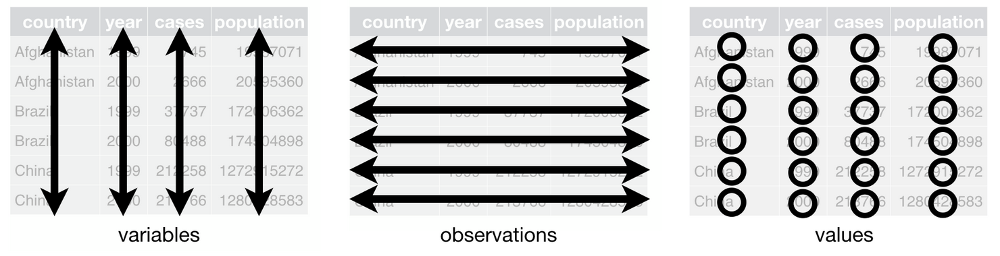

```{r xaringan-themer, include=FALSE, warning=FALSE}
library(tidyverse)
library(xaringanthemer)
style_duo_accent(primary_color = "#8B4513", secondary_color = "#191970",
                 background_color = "#f8f7f3",
                 header_font_google = google_font("Archivo"),
                 text_font_google   = google_font("Inconsolata"), 
                 link_color= "#FFE4B5"
)
```


## Recapitulación
<br>

- Resumen de datos con `dplyr`

- Resumen de datos agrupados con `dplyr`

- Justar bases de datos con llave común


---

## Hoy hablaremos de ...

- Bases de datos ordenadas ("tidy")

- Datos "largos" y datos "anchos"

- Transformación entre datos largos y anchos

---

class: center, middle


---

class: fullscreen, left, middle, text-black
background-image: url("images/typewriter.jpg")

#tidyr

---

## tidyr: herramientas intuitivas para manipulación de datos

<br>

.pull-left[
  
]

.pull-right[
`tidyr` permite:

- obtener un bases de datos "tidy"

]

---
class: inverse, center, middle


.bold[*“Las familias felices son todas iguales, pero cada familia infeliz es infeliz a su manera.”*]

  -Leo Tolstoy

<br>

.bold[*“Tidy datasets son todas iguales, cada dataset desordenaro es desordenado a su manera.”*]

  – Hadley Wickham (creador de Tidyverse)


---
## Bases de datos ordenadas ("tidy")

Una bases de datos está ordenada si:

--

- Cada columna es una variable.

--

- Cada fila es una observación.

--

- Cada celda es un valor único.

<br>



---
## Bases de datos ordenadas ("tidy")

.bold[¿no es siempre así?]
--
 NO!

<br>
.center[

]

.right[.bold[“spreadsheet thinking”]]

---
class: inverse, center, middle

#tidyr::pivot_longer()

---
## De ancho a largo


- `pivot_longer()` reemplaza la función `gather()`

---
## De ancho a largo

.pull-left[
```{r, echo=FALSE, message=F, warning=F}
library("tidyverse")
library("carData")
library("janitor")
library("readr") 


data(WeightLoss)
wl <- WeightLoss %>% select(group,starts_with("w")) %>% as_tibble();  wl
```
- group: a factor with levels Control Diet DietEx.
- wl1: weight loss at 1 month
- wl2: weight loss at 2 months
- wl3: weight loss at 3 months
]
.pull-right[
```{r}
wl %>% 
  pivot_longer(
    cols = starts_with("w")) #<<
```
]

---
## De ancho a largo

.pull-left[
```{r, echo=FALSE}
data(WeightLoss)
wl <- WeightLoss %>% select(group,starts_with("w")) %>% as_tibble();  wl
```
- group: a factor with levels Control Diet DietEx.
- wl1: weight loss at 1 month
- wl2: weight loss at 2 months
- wl3: weight loss at 3 months
]
.pull-right[
```{r}
wl %>% 
  pivot_longer(
    cols = starts_with("w"), 
    names_to="week", 
    values_to= "lbs_lost") #<<
```
]

---
## De ancho a largo

.pull-left[
```{r, echo=FALSE}
data(WeightLoss)
wl <- WeightLoss %>% select(group,starts_with("w")) %>% as_tibble();  wl
```
- group: a factor with levels Control Diet DietEx.
- wl1: weight loss at 1 month
- wl2: weight loss at 2 months
- wl3: weight loss at 3 months
]
.pull-right[
```{r}
wl %>% 
  pivot_longer(
    cols = starts_with("w"), 
    names_to="week", 
    values_to= "lbs_lost",
    names_prefix="wl") #<<
```
]


---
## De ancho a largo, avanzado

.pull-left[
```{r, echo=FALSE}
data(WeightLoss)
wl <- WeightLoss %>% as_tibble() %>% mutate(id = row_number()) %>% relocate(id)
wl
```
- group: a factor with levels Control Diet DietEx.
- wl1: weight loss at 1 month
- wl2: weight loss at 2 months
- wl3: weight loss at 3 months
- se1: self esteem at 1 month
- se2: self esteem at 2 month
- se3: self esteem at 3 month

]

---

## De ancho a largo, avanzado

```{r, code-label, eval=FALSE}
wl %>% pivot_longer(cols = -c(id,group),     
                    names_to = "outcome_week", #<<
                    values_to = "score") #<<
```

--

.pull-left[
```{r, code-label-out, ref.label="code-label", echo=FALSE}
wl %>% pivot_longer(cols = -c(id,group),     
                    names_to = "outcome_week",
                    values_to = "score")
```
]
.pull-right[
- .bold[Problema]: `outcome_week` contiene 2 variables en una sola columna. 

- .bold[Solución]: `separate()`
]

---

## De ancho a largo, avanzado


```{r}
wl_long <- wl %>% pivot_longer(cols = -c(id,group),     
                    names_to = "outcome_week",
                    values_to = "score") %>%
            separate(outcome_week, into = c("outcome", "week"), sep = 2); wl_long #<<
```


---
class: inverse, center, middle


#tidyr::pivot_wider()

---
## De largo a ancho


- `pivot_wider()` reemplaza la función `spread()`


---
## De largo a ancho

Retomando nuestros datos ...

```{r, echo=F, message=F, warning=F}
wl_long
```

Podriamos separar los valores de la variable `outcome` en dos variables separadas: `wl` y `se`, tomado valores de variable `score`

---
## De largo a ancho

```{r}
wl_long %>% 
  pivot_wider(names_from = outcome, values_from = score)  #<<
```


---
## De largo a ancho

¿Y si tuvieramos dos variables que contienen valores (`score`, `error`)?

```{r, echo=F}
wl_long %>% mutate(error = rnorm(n()))
```

---
## De largo a ancho

¿Y si tuvieramos dos variables que contienen valores (`score`, `error`)?

```{r}
wl_long %>% mutate(error = rnorm(n())) %>%
    pivot_wider(names_from = outcome, values_from = c(score, error)) #<< 

```

---
## De largo a ancho

Más aún ...

```{r}
wl_long %>% mutate(error = rnorm(n())) %>%
    pivot_wider(names_from = c(outcome,week), values_from = c(score, error)) #<< 

```


---
class: inverse, center, middle


#tidyr::separate()
#y
#tidyr::unite()


---
## Dos variables en una sólo columna: separar columna 

```{r, echo=F, warning=F, message=F}

data_mpd_messy <- read_delim("mpd2020.csv", delim = ";")

data_mpd <- data_mpd_messy %>% select( `...1`,starts_with("GDP")) %>% row_to_names(row_number = 1) %>%
  rename(year=Region) %>% 
  filter(year!="Year") %>%
  pivot_longer(-year, names_to= "region", values_to="population"); data_mpd
```

---
## Dos variables en una sólo columna: separar columna 

```{r, warning=F, message=F}
data_mpd <- data_mpd %>% separate(region, into = c("zone", "continent"), sep = " ", extra="merge")
data_mpd 
```

---
## Una variable dividad en dos columnas: unir columna

```{r, warning=F, message=F}
data_mpd <- data_mpd %>% unite(col = "region", c("zone","continent"), sep = "-")
data_mpd 
```


---
class: inverse, center, middle


#Combinando herramientas


---
##Combinando herramientas (1)

```{r, warning=F, message=F}
data_mpd_messy <- read_delim("mpd2020.csv", delim = ";")
data_mpd_messy
```

---
##Combinando herramientas (1)

```{r, warning=F, message=F}
data_mpd_messy %>% select(`...1`,starts_with("GDP")) %>% row_to_names(row_number = 1) %>%
  rename(year=Region) %>% #<<
  filter(year!="Year") #<<
```


---
##Combinando herramientas (1)

```{r, warning=F, message=F}
data_mpd_gpd <- data_mpd_messy %>% select(`...1`,starts_with("GDP")) %>% row_to_names(row_number = 1) %>%
  rename(year=Region) %>%
  filter(year!="Year") %>%
  pivot_longer(-year, names_to= "region", values_to="dgp"); data_mpd_gpd #<< data_mpd_gpd 
```

---
##Combinando herramientas (1)

```{r, warning=F, message=F}
data_mpd_pop <- data_mpd_messy %>% select(`...1`,starts_with("Population")) %>% row_to_names(row_number = 1) %>%
  rename(year=Region) %>%
  filter(year!="Year") %>%
  pivot_longer(-year, names_to= "region", values_to="population"); data_mpd_pop
```

---
##Combinando herramientas (1)

```{r, warning=F, message=F}
data_mpd <- data_mpd_gpd %>% left_join(data_mpd_pop, by=c("year","region"))
data_mpd 
```


---
##Combinando herramientas (2)

```{r, echo=FALSE, message=FALSE}
setwd(
  "~/Library/Mobile Documents/com~apple~CloudDocs/Teaching/ISUC/2020_2_data_analysis_r/repo/slides/class_5/")

# leer archivo csv

data_casen_csv <- read.csv("https://raw.githubusercontent.com/mebucca/dar_soc4001/master/data/sample_casen2017.csv")
```

```{r, message=FALSE}
data_casen_csv %>% 
  summarise(across(starts_with("y"), list(media = ~mean(.x, na.rm = TRUE), mediana= ~median(.x, na.rm = TRUE)) ))
```

---
##Combinando herramientas (2)

```{r, message=FALSE}
data_casen_csv %>% 
  summarise(across(starts_with("y"), list(media = ~mean(.x, na.rm = TRUE), mediana= ~median(.x, na.rm = TRUE)) )) %>%
  pivot_longer( #<<
    everything(), #<<
    names_to="outcome_stat", #<<
    values_to="value")  #<<
```

---
##Combinando herramientas (2)

```{r, message=FALSE}
data_casen_csv %>% 
  summarise(across(starts_with("y"), list(media = ~mean(.x, na.rm = TRUE), mediana= ~median(.x, na.rm = TRUE)) )) %>%
  pivot_longer(
    everything(), 
    names_to="outcome_stat",
    values_to="value"
    ) %>%
  separate(outcome_stat, sep="_", into = c("outcome","stat")) #<<
```


---
##Combinando herramientas (2)

```{r, message=FALSE}
data_casen_csv %>% 
  summarise(across(starts_with("y"), list(media = ~mean(.x, na.rm = TRUE), mediana= ~median(.x, na.rm = TRUE)) )) %>%
  pivot_longer(
    everything(), 
    names_to="outcome_stat",
    values_to="value"
    ) %>%
  separate(outcome_stat, sep="_", into = c("outcome","stat") ) %>%
  pivot_wider(names_from = "stat", values_from = "value") #<<
  
```

---
class: fullscreen,left, top, top, text-azzurro
background-image: url("images/bicicleta.jpg")

.huge[#R se aprende]
.huge[#usando y]
.huge[#preguntando]

---


---
class: inverse, middle, center

###Presentación y código en GitHub: <https://github.com/mebucca/dar_soc4001>

---
class: inverse, center, middle


#Gracias!


<br>
Mauricio Bucca <br>
https://mebucca.github.io/ <br>
github.com/mebucca


