class: inverse, center, middle


## Datos: abudantes y complejos

---
class: center, middle 


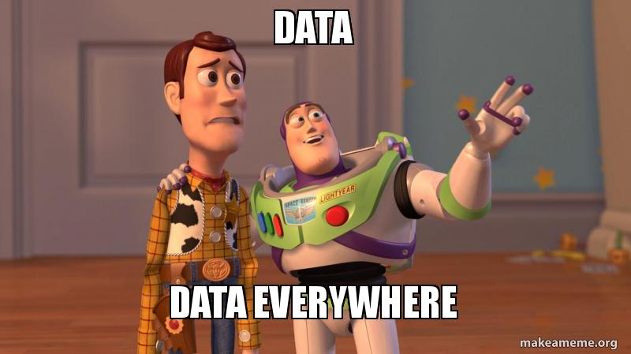


---
## Nuevas formas de datos requieres nuevas herramientas de análisis

.pull-left[
<br>

- Orden de *magnitud* sin precedente: "big-data"

<br>

- Nuevas *fuentes*: encuestas, registros, webpages, "digital traces"

<br>

- Nuevos *formatos*: datos no-estructurados, texto, imágenes, datos relacionales (network data).

]

.img-right2[
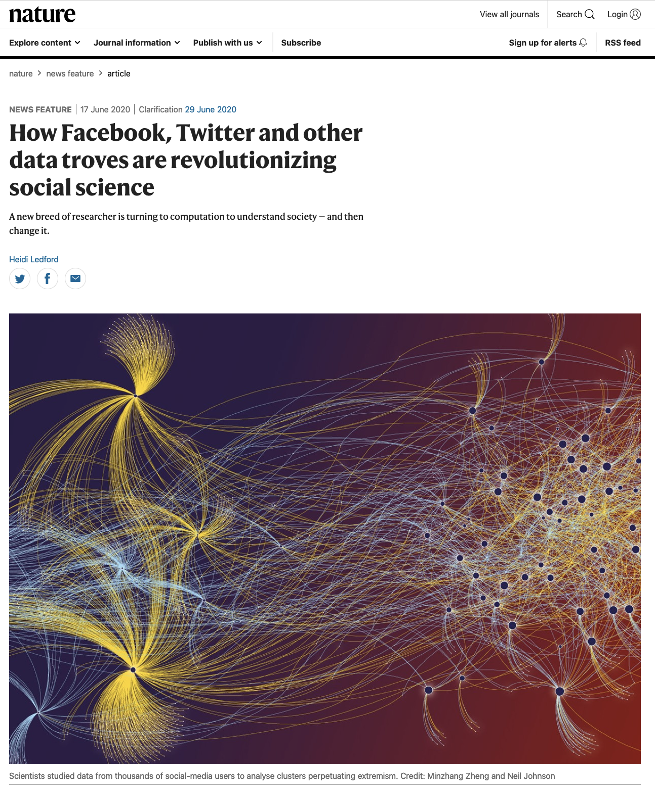
]

---
class: inverse, center, middle

## Data Science Workflow

<br>
--

###Extraer
--

###Procesar

--
###Comunicar


---

## Extraer

.pull-left[
<br>

- Tradicionalmente, recolección manual de datos (encuestas). Previo al trabajo de procesamiento.

- Crecientemenete, recolección automatizada de datos no estructurados

- Web-scraping o web-harvesting: recolección automatizada de datos desde la web

]


.pull-right[
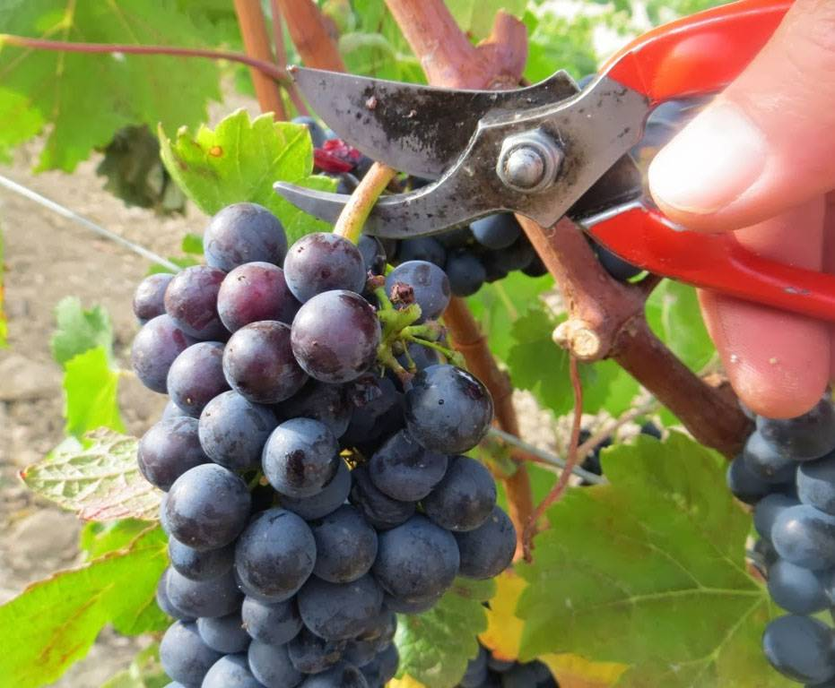
]

---
## Procesar


- Limpiar, modificar, reformatear, crear


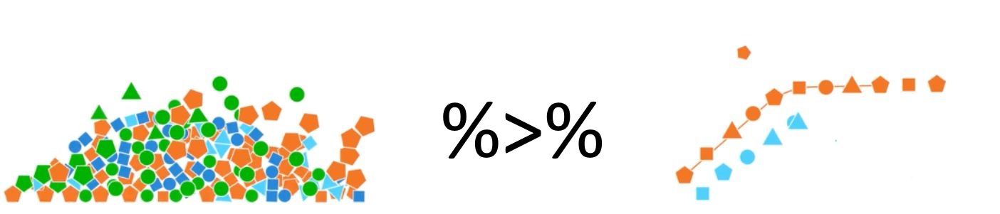

---
## Comunicar

.pull-left[

- Visualización: `ggplot()`

- Reportes y presentaciones automatizadas: `Rmarkdown`,`Xaringan`


- Publicaciones científicas: integración con $\LaTeX$

]


.img-right3[
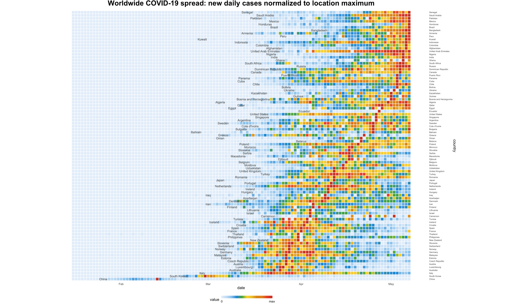
]

---
class: inverse, center, middle

## Un ejemplo, manos a la obra
---
## Datos sobre presidentes de Chile en Wikipedia
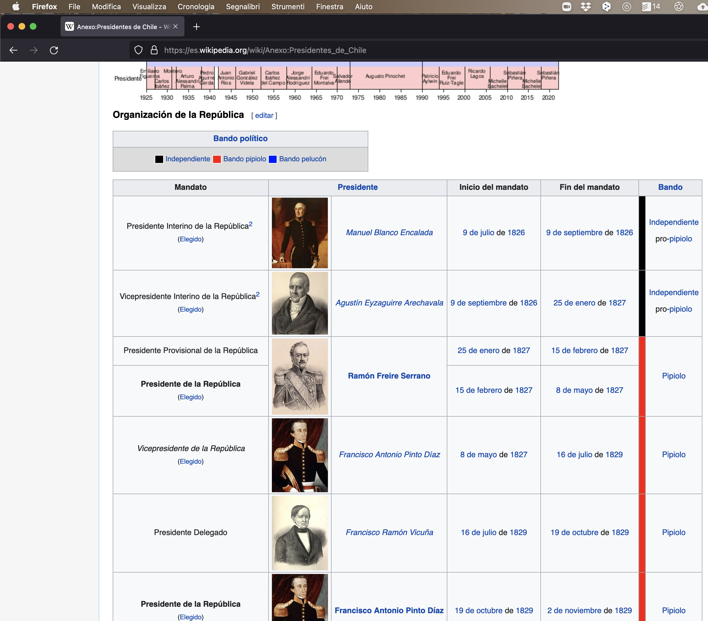


---
## Más allá de "copy-paste"

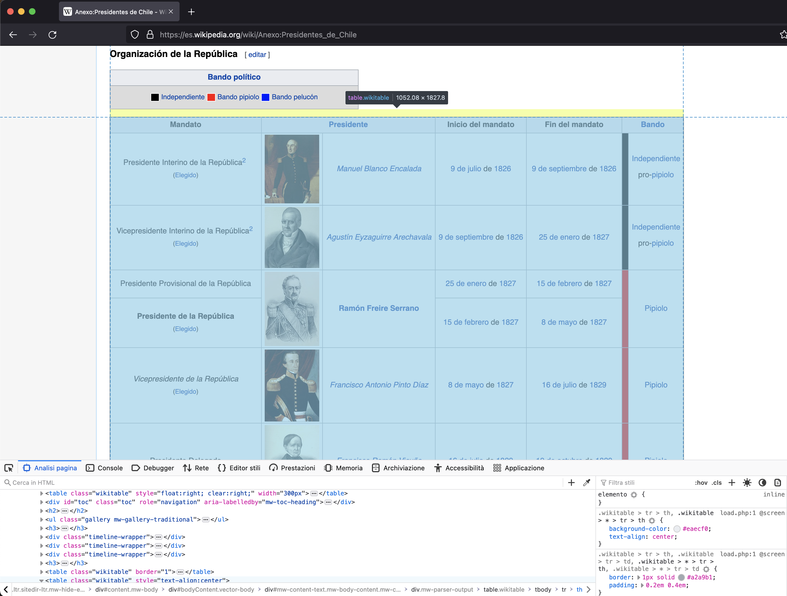
---
## Extraer

```{r, message=FALSE, warning=F, eval=T, echo=F}
library(rvest)
library(tidyverse)
library(pals)
library(ggdark)
```


```{r, message=FALSE, eval=F, echo=T}
pagina <- read_html("https://es.wikipedia.org/wiki/Anexo:Presidentes_de_Chile") #<<
```

--

```{r, message=FALSE, eval=T, echo=F}
pagina <- read_html("https://es.wikipedia.org/wiki/Anexo:Presidentes_de_Chile") #<<
pagina
```


---
## Extraer

```{r, message=FALSE, warning=F, eval=T, echo=F}
library(rvest)
library(tidyverse)
library(pals)
library(ggdark)
```


```{r, message=FALSE, eval=F, echo=T}
presidentes <- pagina %>%
  html_node(xpath = "/html/body/div[3]/div[3]/div[5]/div[1]/table[3]") %>% #<<
  html_table() %>% select(1,3,4,5,7) %>% 
  as_tibble(.name_repair = ~ c("mandato","presidente","inicio","fin","partido"))
```

.img-right4[
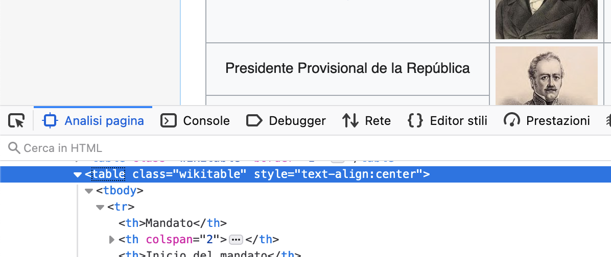
]

```{r, message=FALSE, eval=T, echo=F}

pagina <- read_html("https://es.wikipedia.org/wiki/Anexo:Presidentes_de_Chile") #<<

republica <- pagina %>%
  html_node(xpath = "/html/body/div[3]/div[3]/div[5]/div[1]/table[3]") %>%
  html_table() %>% select(1,3,4,5,7) %>% 
  as_tibble(.name_repair = ~ c("mandato","presidente","inicio","fin","partido"))

cons_lib <- pagina %>%
  html_node(xpath = "/html/body/div[3]/div[3]/div[5]/div[1]/table[5]") %>%
  html_table() %>% select(1,3,4,5,7,9) %>% 
  as_tibble(.name_repair = ~ c("mandato","presidente","inicio","fin","partido","coalicion")) %>%
  mutate(partido = if_else(grepl("Independiente", partido),coalicion,partido)) %>%
  mutate(partido = if_else(partido=="","Independiente",partido)) %>%
  select(-coalicion)


parlam <- pagina %>%
  html_node(xpath = "/html/body/div[3]/div[3]/div[5]/div[1]/table[8]") %>%
  html_table() %>% select(1,3,4,5,7,9) %>% 
  as_tibble(.name_repair = ~ c("mandato","presidente","inicio","fin","partido","coalicion")) %>%
  mutate(partido = if_else(grepl("Independiente", partido),coalicion,partido)) %>%
  mutate(partido = if_else(partido=="","Independiente",partido)) %>%
  select(-coalicion)

pres <- pagina %>%
  html_node(xpath = "/html/body/div[3]/div[3]/div[5]/div[1]/table[10]") %>%
  html_table() %>% select(1,3,4,5,7,9) %>% 
  as_tibble(.name_repair = ~ c("mandato","presidente","inicio","fin","partido","coalicion")) %>%
  mutate(partido = if_else(grepl("Independiente", partido),coalicion,partido)) %>%
  mutate(partido = if_else(partido=="","Independiente",partido)) %>%
  select(-coalicion)

demoh <- pagina %>%
  html_node(xpath = "/html/body/div[3]/div[3]/div[5]/div[1]/table[14]") %>%
  html_table() %>% select(1,3,4,5,7,9) %>% 
  as_tibble(.name_repair = ~ c("mandato","presidente","inicio","fin","partido","coalicion")) %>%
  mutate(partido = if_else(grepl("Independiente", partido),coalicion,partido)) %>%
  mutate(partido = if_else(partido=="","Independiente",partido)) %>%
    select(-coalicion)

presidentes <- bind_rows(republica,cons_lib,parlam,pres,demoh) 

```

--

```{r, message=FALSE, eval=T, echo=F}
print(presidentes)
```

---
## Procesar 

```{r, message=FALSE, eval=F, echo=T}
presidentes <- presidentes  %>%
  filter(grepl("Presidente de la República|Presidenta de la República", mandato)) %>% 
  separate(inicio, into=c("fecha","inicio"), - 4, convert = T) %>% select(-fecha,) %>% 
  mutate(n=1)  %>% arrange(inicio) %>% group_by(partido) %>% mutate(csum_pres = cumsum(n), ultimo=last(inicio)) 
```


```{r, message=FALSE, warning=FALSE,eval=T, echo=F}
presidentes <- presidentes %>%
  filter(grepl("Presidente de la República|Presidenta de la República", mandato)) %>% 
  separate(inicio, into=c("fecha","inicio"), - 4, convert = T) %>% select(-fecha,) %>%
  separate(fin, into=c("fecha","fin"), - 4, convert = T) %>% select(-fecha,-mandato) %>%
  separate(partido, into=c("partido","otro"), sep = "([.[.])") %>% select(-otro) %>%
  mutate(partido = if_else(presidente=="Ricardo Lagos Escobar","Socialista",partido)) %>%
  mutate(fin = if_else(inicio==2018,"2021",fin)) %>% mutate(fin=as.numeric(fin)) %>% 
  mutate(n=1)  %>%  arrange(inicio) %>% group_by(partido) %>% mutate(csum_pres = cumsum(n), ultimo=last(inicio)) 
```

--

```{r, message=FALSE, warning=FALSE,eval=T, echo=F}
print(presidentes)
```

---
## Comunicar


```{r, message=FALSE, warning=FALSE,eval=F, echo=T}
presidentes %>% 
  ggplot(aes(x=inicio, y=csum_pres, color=reorder(partido, ultimo))) +  #<<
  geom_point() + geom_line() +
  labs(x="Año", y="Número acumulado de Presidentes", colour="Partido/Coalición") +
  scale_color_manual(values=as.vector(stepped3(16))) + dark_theme_grey()
```

--
.center[
```{r, message=FALSE, warning=FALSE,eval=T, echo=F, fig.height=5, fig.width= 8}
presidentes %>% ggplot(aes(x=inicio, y=csum_pres, color=reorder(partido, ultimo))) +
  geom_point() + geom_line() +
  labs(x="Año", y="Número acumulado de Presidentes", colour="Partido/Coalición") +
  scale_color_manual(values=as.vector(stepped3(16))) + dark_theme_grey()
```
]

---
## ¿Por qué automatizar algo que puedo hacer manualmente?

--

<br>

.pull-left[
- Eficiencia (o factibilidad!)


- Fiabilidad 


- Reproducibilidad


- Transparencia

]

.img-right2[
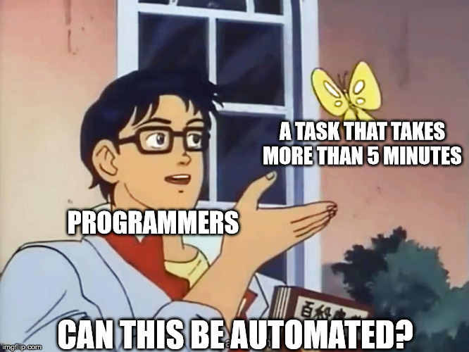
]

---
class: inverse, center, middle

## ¿Por qué R?


---
class: middle
##R es lingua franca de la ciencia de datos

.center[
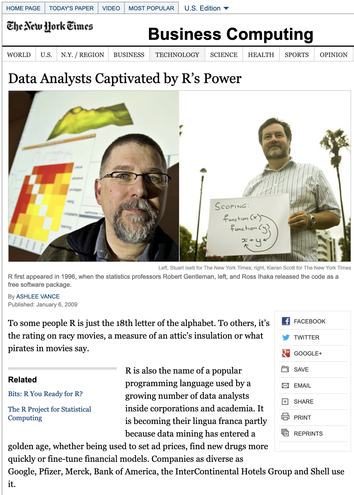
]

---
## Ventajas de R

--

- Código libre y abierto

--

- En desarrollo constante 

--

- Flexible. Se amplia fácilmente a través de _paquetes_ desarrollado por usuarios

--

- Comunidad activa y robusta


--

- Entre las herramientas informáticas mejor pagadas del mercado

---
## R entre analistas de datos
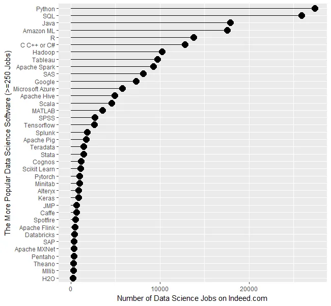

---

## R en la academia

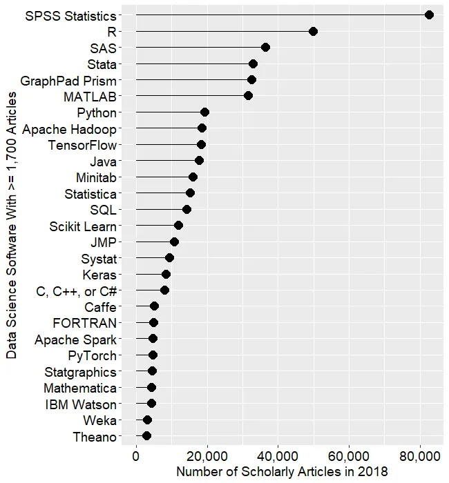

---
## ¿Y los otros?

.img-center[

]

--


- R combina lo mejor de varios mundos


---
class: inverse, center, middle

## Diplomado en WebScraping y visualización de datos sociales en R


<br>
###Extraer: (Curso 3) "Webscraping y Acceso a Datos desde la Web"
--

###Procesar: (Curso 1) "Procesamiento Avanzado de Bases de Datos en R"

--
###Comunicar:(Curso 2) "Visualización de Datos usando R"


---
class: inverse, center, middle

.huge[
**Muchas gracias!**
]

<br>
Mauricio Bucca <br>
https://mebucca.github.io/ <br>
github.com/mebucca


